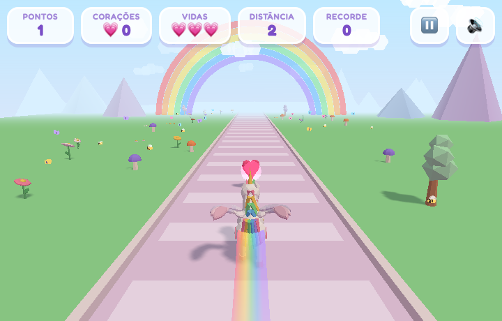
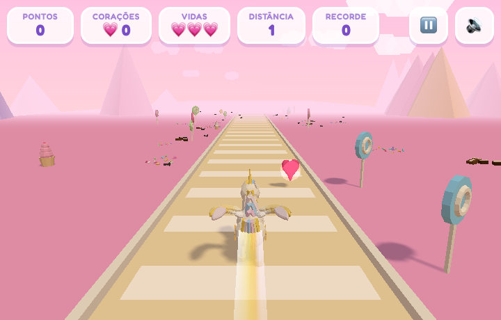
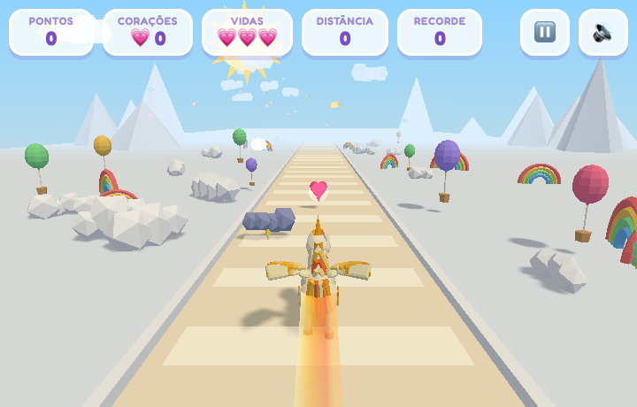
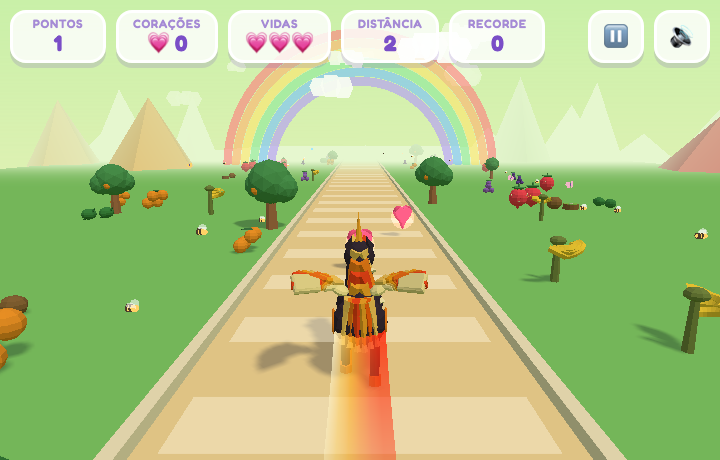
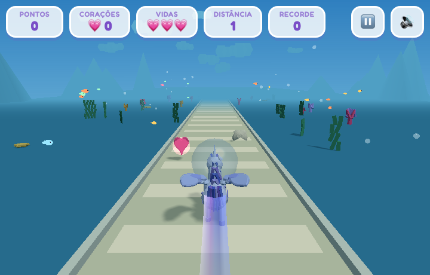
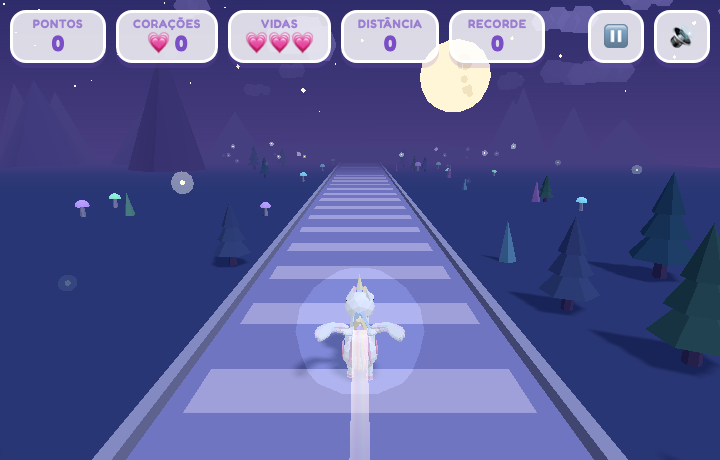

# 🦄 UnicornRush

Jogo infantil de corrida feito com [three.js](https://threejs.org/): seis
unicórnios correm por pistas mágicas juntando corações e chaves, desviando de
obstáculos e pegando power-ups. Roda no navegador, sem build e sem nada vindo
de fora — dá até para instalar no celular e jogar offline.

## As pistas

| | |
| :---: | :---: |
|  |  |
| **🌈 Campo** — flores, cogumelos, borboletas e abelhas | **🍭 Doces** — pirulitos, granulado, chocolate e formigas |
|  |  |
| **☁️ Céu** — mar de nuvens, balões e passarinhos | **🍓 Frutas** — pomar cheio (aqui com o Brasa e seu rastro de fogo) |
|  |  |
| **🐠 Oceano** — corais, peixinhos e bolha de ar na cabeça | **🌙 Noite** — lua cheia, vagalumes e o unicórnio brilhando |

## Personagens

O elenco planejado é de **21 unicórnios**; **dezenove estão prontos** e os
outros dois aparecem na grade como espaço vazio, com um `?` e "em breve" — a criança
vê que tem mais coisa vindo. A grade tem três colunas e rola por dentro do
cartão; as pontas desbotam quando há mais para ver.

Os retratos são de perfil, renderizados a partir dos próprios modelos, não
imagens prontas. A grade não tem legenda nenhuma: quem quiser saber quem é
cada um abre a ficha. Tocar num retrato abre a **ficha** dele — retrato grande,
quem é, a historinha inteira e um botão só. É a mesma tela para todos; o que
muda é o botão: **✅ Escolher esse** para quem já é seu, **🔑 Trocar N
chaves** para quem está à venda e você tem chaves, e **🗺️ Buscar chaves**
quando faltam (esse leva direto para as fases). A ficha da pista mostra a
música dela no lugar do preço.

### O que voa em volta de cada um

Correndo, cada unicórnio solta o **seu** punhado de coisinhas: o Relâmpago
larga raios, o Musgo perde folhinhas, o Floco deixa cair gelo, a Violeta vai
fumaçando. Não é o rastro (esse é o arco-íris no chão) nem as auras de
power-up (essas vêm e vão): é o jeito dele, sempre ligado, e é o que faz dar
para reconhecer quem está correndo mesmo de longe ou de costas.

São sete formas, todas desenhadas por código como o resto — faísca, raio,
folha, floco, bolha, anel e morcego —, recombinadas com as cores de cada um:

| | | | |
| --- | --- | --- | --- |
| ⚡ Relâmpago · 🍋 Limão | raios | 🍃 Musgo · 🍒 Cereja · 🥥 Coco | folhas |
| 🧊 Floco | flocos de gelo | 🫧 Chiclete · 🌊 Onda · 🤍 Lulu · 🍿 Pipoca · 🐚 Pérola | bolhas |
| 🔮 Violeta · 🎩 Vovô | anéis que abrem | 🦇 Sombra | morceguinhos |
| os outros sete | faíscas | | |

Cada personagem descreve o seu numa linha em `characters.js`
(`aura: { kind, color, count }`), e quem anima é `characterAura.js`: as peças
nascem junto ao corpo, saem andando para trás — mais depressa quanto mais
rápida a corrida — e somem. Cada forma some do seu jeito: o raio **pisca**
(que é o que raio faz), o anel **abre** enquanto desaparece e o morcego bate
asa. A fumaça começou como esferinhas translúcidas e foi trocada pelos anéis:
de perto, esfera cheia lia como bolha de gás, não como fumaça.

### O jeito de correr de cada um

**Todo unicórnio, menos a Uni, tem uma característica que muda como se
joga.** A Uni fica sem nenhuma de propósito: ela é a que vem de graça, e é
com ela que a criança aprende o jogo cru, sem nada por cima.

O campo mora no próprio personagem, em `src/models/characters.js`, e é lido
onde faz sentido — `updatePlayer`, `collect`, `hit`, `takePower`, o laço.
Quando personagem e pista têm o mesmo campo, eles se **multiplicam**: o chão
escorregadio da Geada atrapalha todo mundo, e por cima disso a Cereja é
ligeira e o Vovô é lento.

Cada número abaixo foi **medido em jogo**, não estimado:

| Unicórnio | Campo | O que muda |
| --- | --- | --- |
| ☀️ Sol | `powerTime: 1.5` | power-ups duram **12 s em vez de 8** |
| 🌙 Lua | `magnetRange: 3.4` | os itens que passam perto **vêm um pouquinho até ela**, sem power-up |
| 🔥 Brasa | `speedRamp: 1.6` | a velocidade sobe a **0,56/s contra 0,35** |
| 🤍 Lulu | `extraLives: 1` | corre com **4 vidas** em vez de 3 |
| ⭐ Estrela | `starValue: 2` | a estrela vale **10 corações em vez de 5** |
| 🫧 Chiclete | `startShield: 5` | começa cada corrida com **5 s de bolha** |
| 🍃 Musgo | `speedRamp: 0.55` | a velocidade sobe a **0,19/s** — o mais fácil de guiar |
| 🌊 Onda | `topSpeed: 1.14` | o teto vai a **29,6 em vez de 26** |
| 🧊 Floco | `steady: true` | **ignora o chão escorregadio**: 17 quadros na Geada contra 40 |
| 🥥 Coco | `firstHitFree` | a **primeira batida da corrida não custa vida** (ainda dói) |
| ☄️ Cometa | `extraJump: 1` | **três pulos** no ar em vez de dois |
| 🍒 Cereja | `laneGrip: 1.5` | troca de faixa em **11 quadros** contra 17 |
| 🎩 Vovô | `laneGrip: 0.6` | troca em **30 quadros** — e leva o rastro mais largo (1,5) |
| 🍋 Limão | `jumpBoost: 1.12` | o pulo sobe **2,52 contra 2,0**. A altura vai com o quadrado da velocidade, por isso 1,12 rende ×1,25 |
| 🔮 Violeta | `airGlide: 0.78` | fica **64 quadros no ar** contra 49 |
| 💎 Cristal | `translucent: 0.72` | o **corpo** fica de vidro (crina, rabo, asas e marca ficam opacos, senão ela desaparecia) |
| 🦇 Sombra | `glow` | acende e ganha halo **em qualquer pista** |
| ⚡ Relâmpago | `windproof: true` | **ignora o vento lateral** da Tempestade: sem ele o vento empurra até a borda da pista (±3,1) em cerca de 2 s |
| 🍿 Pipoca | `heartValue: 2` | **cada coração vale 2** — o par que faltava para a Estrela, que dobra as ⭐ e deixava os 💗 em 1 |
| 💫 Eco | `reach: 3.4` | **pega os itens das faixas ao lado** — os ecos dele correm lá, e dá para vê-los. Vale só para o que se pega: obstáculo continua com o alcance normal, senão ele apanharia da pista vizinha |
| 🐚 Pérola | `keyLuck: 1.8` | **as chaves nascem mais**: a chance sobe 80% e a espera mínima entre uma e outra encurta na mesma medida. Medido nas Fases, 3 min de corrida: 15 chaves com qualquer um, **26 com ela** (1,73×) |

O campo `power` de cada personagem é a frase que a **ficha mostra**, em
linguagem de criança ("a primeira batida não machuca ele"), com o destaque
mais forte do cartão — é ela que responde "por que escolher este?".

Sem esses campos o unicórnio corre do jeito normal, então inventar o próximo
continua sendo só uma entrada na tabela.

### A pista de cada um

Cada unicórnio tem **uma ou duas pistas em que ele corre mais rápido** — é o
que diferencia um do outro além da cor, e a ficha dele diz quais são. Correndo
numa delas, um botão **⚡ RÁPIDO** aparece no HUD **logo abaixo da dupla
pause + som**: apertar faz o mundo passar 35% mais rápido, apertar de novo
volta ao normal.

Ele é o maior controle do canto de propósito — é o único botão que muda a
corrida enquanto ela acontece, e o único que a criança precisa achar sem
tirar o olho da pista. Antes desenhava do tamanho de um botão só e se perdia
entre o pause e o som, três ícones iguais em fila. Agora é uma pílula larga
com a palavra escrita, e tem largura própria: numa tela estreita os painéis
do HUD espremem o grupo de controles para uns 57 px, e acompanhar isso o
deixaria menor do que era. Ancorado à direita, ele cresce para a esquerda,
para dentro do céu vazio embaixo dos painéis. Enquanto está disponível e
desligado, um anel dourado abre e some, chamando o dedo; ligado, ele fica
dourado cheio, com a palavra em branco e o pulso mais rápido — dá para ver
pelo canto do olho, correndo. O velocímetro logo abaixo tem a mesma largura,
para o canto ser um grupo só. Vale nos **três modos** — nas Fases
correr mais rápido junta as chaves antes, ao preço de mais obstáculo por
segundo; no Livre, onde não há obstáculo, é só diversão.

Nas Fases o ⚡ **atravessa a troca de fase**: quem escolheu correr rápido não
precisa apertar de novo a cada fase. Ele só cai fora sozinho se a fase
seguinte for numa pista em que aquele unicórnio não é rápido.

Na **grade de pistas** um ⚡ marca, no canto de cada miniatura, as pistas em
que o unicórnio escolhido é rápido — inclusive nas que ainda estão à venda,
porque isso ajuda a decidir qual comprar. A linha logo abaixo do título diz
de quem é o raio.

Dá para ver no unicórnio, não só no HUD: com o ⚡ ligado as **asas crescem
50% e acendem** e o **rastro engorda 90% e ganha estrelinhas** correndo por
cima dele, que giram, piscam e vão sumindo para trás. Tudo volta sozinho ao
desligar. A transição é suave nos dois
sentidos, senão ele mudaria de tamanho num salto no meio da corrida. O brilho
soma ao da pista — na Noite, onde todo mundo já é aceso, as asas ficam ainda
mais.

É opcional de propósito. Mais veloz é mais divertido e rende mais distância,
mas também é mais obstáculo por segundo — quem decide é a criança, no meio da
corrida. Fora das pistas dele o botão nem aparece.

| Unicórnio | Voa em | Por quê |
| --- | --- | --- |
| 🌈 Uni | Campo | o arco-íris do Campo é dela |
| ☀️ Sol | Céu, Frutas | o sol mora no céu e amadurece as frutas |
| 🌙 Lua | Noite, Geada | a noite é a hora dela, e a geada tem o mesmo silêncio |
| 🔥 Brasa | Vulcão, Noite | o vulcão é a casa dele, e as brasas iluminam a noite |
| 🤍 Lulu | Céu | branquinha como as nuvens |
| ⭐ Estrela | Espaço, Noite | ela caiu de lá: no espaço está em casa |
| 🫧 Chiclete | Doces | os doces são a casa dela |
| 🍃 Musgo | Campo, Frutas | mato e pomar são o quintal dele |
| 🌊 Onda | Oceano, Praia | nasceu na espuma: o mar inteiro é dela |
| 🧊 Floco | Geada, Noite | a geada é dele, e a noite gela do mesmo jeito |
| 🥥 Coco | Praia, Frutas | a praia é dele, e no pomar também se dá bem |
| ☄️ Cometa | Espaço | ele é de lá |
| 🍒 Cereja | **Parque**, Doces | o parque é dela: é onde mais se desvia |
| 🍋 Limão | **Tempestade**, Frutas | elétrico como a tempestade, e é fruta |
| 🔮 Violeta | **Bruma**, Noite | ela é meio feita de névoa |
| 💎 Cristal | **Caverna**, Geada | os cristais da caverna são parentes dela |
| 🎩 Vovô | **Vilarejo**, Campo | o vilarejo é a rua onde ele cresceu |
| 🦇 Sombra | **Caverna**, Vulcão | o subterrâneo é a casa dele |
| ⚡ Relâmpago | **Tempestade**, Céu | nasceu no raio da tempestade, e mora nas nuvens do Céu |
| 🍿 Pipoca | **Parque**, Vilarejo | as duas pistas de gente, onde a música não para |
| 🐚 Pérola | **Oceano**, Bruma | as duas de pouca visibilidade: ela enxerga onde ninguém enxerga |
| 💫 Eco | **Bruma**, Vilarejo | a neblina onde ele viveu invisível, e o lugar com mais gente |

O campo `fast` de cada personagem em `src/models/characters.js` é só a lista
de ids de pista; o multiplicador fica em `RUSH_SPEED`, no `config.js`.

**Só a Uni vem liberada.** Todo o resto é trocado por chaves mágicas (ver
*A loja*).

Cada um tem corpo, crina, chifre, asas, marca na anca e rastro próprios:

| | Personagem | Jeitão | História |
| --- | --- | --- | --- |
| 🌈 | **Uni** | branca, crina arco-íris, asas de penas, rastro de sete cores | Nasceu na ponta de um arco-íris, num dia de sol com chuva. Onde ela pisa fica colorido. |
| ☀️ | **Sol** | dourado, crina de fogo, asas em raios de sol, rastro alaranjado | Acorda antes de todo mundo para acender o dia; seu rastro morninho faz as flores abrirem. |
| 🌙 | **Lua** | lilás clarinho, crina azul da noite, asas de véu, rastro violeta | Só sai quando escurece, para cuidar dos sonhos de quem dorme. Conhece todos os atalhos da noite. |
| 🔥 | **Brasa** | o único **macho** e o maior da turma (18% maior que os outros, de pernas compridas): corpo escuro, chifre grande, asas em raios de fogo e **crina e rabo em labaredas** que tremem e esticam. O rastro dele é um caminho de brasas. Fala grosso — os sons de coleta são mais graves. | Corre tão rápido que a crina pega fogo; onde ele passa fica um caminho de brasas quentinhas que some devagar. |
| 🤍 | **Lulu** | unicórnia **bebê**: pequenina (78% do tamanho dos outros), cabeçuda, olhos grandes e perninhas curtas, toda branca com crina em tons pastel e um coração na anca. O rastro dela é **um fiozinho** de brilho e ela pega os itens com uma **vozinha bem aguda** | É a menorzinha do grupo e ainda está aprendendo a voar; branquinha como nuvem, deixa um fiozinho de brilho por onde passa. |
| ⭐ | **Estrela** | dourada clara, crina de brilho, asas cor de creme, rastro de luz | Caiu do céu numa noite de agosto e ficou para brincar. Brilha tanto que as estrelinhas correm junto. |
| 🫧 | **Chiclete** 🔑 10 | rosa forte, crina de chiclete, olho grande e corpo pequeno de quem vive quicando; marca de bolha na anca | Faz bolhas do tamanho da cabeça dela e sai quicando pela pista; quando a bolha estoura, ri até precisar parar. |
| 🍃 | **Musgo** 🔑 18 | verde, **atarracado** (6% maior, mas de pernas curtas), chifre de madeira, crina de mato e folha na anca; o mais lento de se olhar | O mais calmo da turma, conhece cada árvore pelo nome. Onde ele cochila de tarde, no dia seguinte nasce uma flor. |
| 🧊 | **Floco** 🔑 34 | **azul-gelo** (não branco, para não se perder entre a Uni, a Lulu e a Estrela), crina azul-escura, parrudo e de perna curta, asas de pena bem claras, floco de neve na anca | Dorme o verão inteiro e acorda no primeiro dia frio; sopra baixinho e o ar vira purpurina de gelo. |
| 🥥 | **Coco** 🔑 38 | o **único marrom** do elenco: cor de casca, crina verde de folha de coqueiro, redondinho e de perna curta, concha na anca | Dormiu tanto debaixo do coqueiro que ficou da cor da casca; sabe o lugar exato onde a onda faz mais espuma. |
| 🍒 | **Cereja** 🔑 44 | o **vermelho** que faltava, crina verde-escura como o cabinho, miúda; **troca de faixa 50% mais rápido** | Não anda: desvia. Trocaria de pista duas vezes antes de a poeira do primeiro desvio assentar. |
| 🍋 | **Limão** 🔑 48 | amarelo-limão, o segundo menor depois da Lulu, crina espetada, a voz mais aguda; **pula 25% mais alto** | O menor depois da Lulu e não para quieto; quando pula, dá até para ouvir um estalinho no ar. |
| 🔮 | **Violeta** 🔑 54 | **roxo saturado** (a Lua é lilás pálido), crina que parece fumaça, asas de véu; **cai mais devagar** | É meio feita de fumaça: quando salta, demora para descer, como se o ar segurasse ela. |
| 💎 | **Cristal** 🔑 60 | **corpo translúcido** — o único de vidro no elenco —, alta e magra, brilhante de gelo | Transparente como uma janela de gelo; dá para ver o arco-íris passar por dentro dela. |
| 🎩 | **Vovô** 🔑 66 | o **cinza/prata** que faltava, crina branca comprida, o maior do elenco; **vira devagar, mas tem o rastro mais largo do jogo** | Já correu em todas as pistas, algumas antes de elas terem nome. |
| 🦇 | **Sombra** 🔑 72 | **preto puro**, sem o laranja do Brasa, com **asas de morcego** em vez de pena; **acende sozinho em qualquer pista** | Preto de verdade, sem um fiozinho de cor. Brilha por conta própria, então nunca corre no escuro. |
| ☄️ | **Cometa** 🔑 42 | índigo com crina em ciano e rosa, **perna comprida e cabeça pequena**, asas em raios que lêem como cauda | Não sabe parar: desde que nasceu está atravessando o céu. Dizem que quem o acompanha ganha um pedido. |
| 🌊 | **Onda** 🔑 32 | **turquesa** de corpo inteiro (puxa para o verde, ao contrário do azul do Floco), com **chifre e mecha de coral** como acento quente, **esguia e de pernas compridas**, asas de véu que lêem como nadadeira | Nasceu numa espuma de onda grande e nunca aprendeu a andar devagar; debaixo d'água é a mais rápida de todas. |
| ⚡ | **Relâmpago** 🔑 78 | **azul-tempestade** escuro, crina elétrica em amarelo e branco, chifre e marca de raio na anca; **o vento da Tempestade não o desvia** | Nasceu no talho de um raio, numa noite de tempestade. Corta a Tempestade em linha reta, onde todo mundo é empurrado de lado. |
| 🍿 | **Pipoca** 🔑 75 | **creme de pipoca** com o vermelho da caixa listrada, crina de milho estourando, estrela vermelha na anca; **cada coração vale 2** | Mora onde a música nunca para, entre o carrossel do Parque e as pedras do Vilarejo. Onde ele passa cheira a manteiga. |
| 🐚 | **Pérola** 🔑 81 | **branco-perolado** com reflexo rosa e azul, asa de véu, concha na anca; **acha mais chaves mágicas** | Cresceu dentro de uma concha, no escuro do fundo do mar. Enxerga onde ninguém enxerga — e acha chaves que passariam despercebidas. |
| 💫 | **Eco** 🏆 | **branco-lilás de neblina**, asa de véu, coração roxo na anca; **o eco dele pega o que está na faixa ao lado**. Não tem preço: aparece quando os 21 amigos estiverem livres | Era invisível, e só a alegria podia deixá-lo visível. De tanto esperar sozinho, achou que prendendo todo mundo teria amigos. Foi a Uni quem o encontrou. |

Tudo isso é dado, não código: cada personagem é uma entrada em
`src/models/characters.js` com as cores, o estilo do chifre, das asas
(`feather`, `ray`, `veil` ou `bat`), a marca da anca (`rainbow`, `sun`, `moon`,
`star`, `heart`, `flame`, `leaf`, `wave`, `bubble`, `snowflake`, `comet`,
`shell`, `bolt`, `diamond`), as cores e a largura do rastro e, se quiser, o `price` em chaves, o tamanho
(`scale`), as proporções (`proportions`: cabeça, olhos e pernas — é o que faz
a Lulu parecer um bebê e o Brasa parecer adulto), o `fiery` (que acende a
crina e o rabo em chamas) e a `voice`, que é o tom dos sons de coleta (1 é o
normal; a Lulu usa 1,5, uma quinta acima). Para inventar o vigésimo
basta acrescentar mais uma entrada lá — o modelo 3D se monta sozinho.

### A loja

As **chaves mágicas** 🔑 são a moeda do jogo: elas somam para sempre e é com
elas que se destrava tudo. O jogo começa com **um unicórnio (a Uni) e uma
pista (o Campo)**; os outros 8 unicórnios e as outras 5 pistas prontas têm
`price` e são trocados por chaves.

Quem tem preço começa trancado: na grade aparece com o retrato desbotado, um
cadeado na quina e o preço no lugar do nome. Tocar nele abre a **tela da
troca** — retrato grande, o texto inteiro, quanto custa, quanto você tem, e
um botão só. É a mesma tela para unicórnio e para pista (`Game.showShopOffer`
recebe qual dos dois).

Quando falta chave, o botão não some: ele vira **🗺️ Buscar chaves** e leva
direto para a grade das fases, que é de onde as chaves vêm. Beco sem saída
com criança não funciona.

| | Preço em chaves |
| --- | --- |
| Unicórnios | Sol 4 · Lua 6 · Estrela 9 · Lulu 12 · Brasa 16 · Chiclete 20 · Musgo 26 · Onda 32 · Floco 34 · Coco 38 · Cometa 42 · Cereja 44 · Limão 48 · Violeta 54 · Cristal 60 · Vovô 66 · Sombra 72 · Relâmpago 78 |
| Pistas | Doces 5 · **Vilarejo 7** · Céu 8 · Frutas 12 · Praia 15 · Oceano 18 · Noite 22 · Geada 26 · Vulcão 30 · Parque 32 · Espaço 36 · Tempestade 40 · Bruma 46 · Caverna 54 |

Os preços seguem o ritmo do modo Fases: a **fase 1 já dá as 3 chaves** que
quase pagam o Sol. Uma volta completa pelas doze fases de uma pista dá 96
chaves, e a Aventura pinga mais algumas. Ter tudo o que existe hoje custa
188 chaves — cerca de duas voltas, e cada pista nova traz doze fases a mais.

As setas do teclado passeiam só pelo que já é seu; o trancado se pega tocando
nele, e o espaço vazio responde com uma chacoalhada e um "ainda está sendo
feito".

As chaves vêm de dois lugares.

**Da pista**, nas **Fases** e na **Aventura**. Nas Fases elas são a meta (uma
a cada ~12 linhas, ~8 s de corrida); na Aventura são só moeda e saem **bem
mais raras** — uma a cada ~27 linhas, perto de 15 s. Lá o HUD mostra só
quantas saíram, sem meta, e cada uma vai direto para a carteira: mesmo que a
corrida acabe no segundo seguinte, a chave fica. No **Livre** ela também
nasce, mais espaçada (~16 linhas), e é a renda principal de quem só joga
lá: **~1,8 chaves já na primeira corrida**, e nenhuma corrida termina em
zero — medido em 400 simulações por ajuste.

Isso deixa o Livre em ~7 chaves por minuto contra ~10 das Fases, o que é
mais perto do que se gostaria para uma pista **sem risco nenhum**. Foi uma
escolha, não um descuido: a primeira corrida do Livre dura uns 16 s, e
espaçar a chave o bastante para derrubar o rendimento traz de volta a
corrida que acaba com a carteira em zero. Entre as duas, a criança de três
anos que termina sem nada é o problema pior. O ajuste fica em
`MODES.baby.keyGap`.

**Dos corações**, em qualquer modo: **a cada 50 corações juntados** aparece
uma chave. A contagem é somada entre corridas e fica no save
(`stats.heartsToKey`), e a estrela, que vale 5, pode fechar a conta de uma
vez. É a segunda fonte de quem joga o **Livre**, somada à chave da pista.

E a regra se explica sozinha, sem texto: ao fechar os 50, **cinquenta
corações aparecem em volta do unicórnio, giram para dentro encolhendo, e no
lugar deles nasce a chave**, que sobe e some. Os cinquenta dividem uma
geometria e um material só, então a animação inteira custa pouco (ver
`src/models/keyReward.js`).

### Ver de perto e girar

A ficha de cada unicórnio tem o botão **🔄 Ver em 3D**: abre o modelo de
verdade num painel, girando devagar sozinho, e o dedo (ou o mouse) o gira
para qualquer lado. É onde se vê o que o retrato esconde — o outro lado da
crina, a marca da anca, as asas por trás.

O retrato da grade é uma foto de perfil, sempre do mesmo ângulo, gerada uma
vez e guardada. Aqui é o `createUnicorn` rodando ao vivo, com o mesmo
`animateUnicorn` do jogo: ele galopa parado enquanto se gira.

Quem gira é um **pivô**, não o unicórnio: assim o `animateUnicorn` continua
mandando na pose sem brigar com a rotação do dedo. A inclinação para cima e
para baixo é presa em ±0,5 rad — de cabeça para baixo ninguém reconhece o
personagem, e uma criança não teria como voltar.

O botão **não aparece no Eco enquanto ele for mistério**: examinar de perto
quem ninguém deveria conseguir ver estragaria o fim da história.

**A distância da câmera foi medida, não escolhida no olho.** Girando o maior
do elenco de 30 em 30 graus e medindo a silhueta a cada volta, 6,9 é onde
ele enche 90% da altura sem tocar a moldura em nenhuma delas; a 6,4 estoura
e a 7,8 sobra margem. Os menores aparecem menores de propósito, como no
retrato — o tamanho faz parte do personagem.

Cada abertura monta o próprio contexto WebGL e o **descarta ao sair**
(`Game.fecharViewer`). Sem isso, abrir a ficha de dez unicórnios deixaria
dez contextos para trás, e o navegador, ao estourar o limite, começa a
descartar os antigos — inclusive o do jogo, que está rodando atrás do
cartão.

### O portal que se abre

Trocar chaves por um unicórnio ou uma pista é a maior conquista do jogo —
custa dezenas de corridas. Antes disso era um avisinho passando na tela.
Agora é o **portal do livro da história** abrindo de verdade, o mesmo da
página *"O segredo do arco-íris"*: arco de pedra roxa, o emoji de quem está
sendo destrancado no alto e um cadeado dourado na frente.

A cena leva uns três segundos e conta uma coisa de cada vez: o cadeado
chacoalha, o arco dele cede (é aí que sai o som da chave), o cadeado despenca,
as portas giram para fora, um clarão sai de dentro e o retrato passa de
silhueta preta a cor cheia — com faíscas e a fanfarra. Só então aparece o
nome.

O unicórnio flutua dentro do escuro, porque é uma figura recortada; a pista
**preenche o vão inteiro**, e o portal vira uma janela para o lugar — que é
exatamente como as pistas trancadas aparecem no livro. Um toque (ou uma
tecla) fecha antes da hora, para quem já viu; sozinho ele sai em 4,6 s.

Tudo é CSS por cima do retrato que a grade já usa (`#reveal` no `style.css`,
`Game.revealUnlock`) — nenhuma imagem nova. Quem pediu menos movimento ao
aparelho vê o fim da história direto: portal aberto, retrato revelado, sem
nada girando nem caindo.

## Pistas

Também dá para escolher por onde correr — a pista muda o céu, a neblina, a
luz, o chão, os enfeites das laterais, os bichinhos que voam por perto e até
os obstáculos. São **15 pistas**, e **as quinze estão prontas** — a grade de pistas não tem
mais espaço vazio. Só o **Campo** vem liberado — as outras são trocadas por chaves:

| | Pista | Como é |
| --- | --- | --- |
| 🌈 | **Campo** | O campo encantado: grama verde, **flores** (com caule, folha e pétalas) e tufinhos floridos rentes ao chão, **árvores frondosas com frutinhas** (copa larga em tom pastel, com frutas vermelhas ou douradas penduradas na borda), cogumelos, cristais, **borboletas e abelhas voando** e um arco-íris gigante no horizonte. Obstáculos de pedra, barreira de doce e arbusto espinhoso. |
| 🍭 | **Doces** | Mundo de confeitaria: chão de cobertura rosa, pista de biscoito, pirulitos, cupcakes, bengalas doces, **granulado colorido**, **pedacinhos de chocolate** espalhados pelo chão e **formigas** andando em fila pelas beiradas. Obstáculos de bala de goma, rosquinha e barra de doce. |
| 🎩 | **Vilarejo** | Uma rua de pedra ao pôr do sol: casinhas de telhado de barro com a luz acesa na janela, lampiões, poço com telhadinho e pombos. É a **pista mansa** — pouca coisa no caminho e nenhuma barreira —, e é barata de propósito: quem mais precisa dela é quem tem menos chaves. |
| ☁️ | **Céu** | Em cima das nuvens: chão de algodão, estrada dourada, sol grandão com raios, balões, arquinhos de arco-íris, morrinhos de nuvem e **passarinhos cruzando o céu**. Obstáculos de nuvem carregada, pipa e cacho de balões. |
| 🍓 | **Frutas** | Pomar cheio: grama, caminho de areia clara, morangos do tamanho de arbusto, laranjeiras carregadas, as mesmas árvores frondosas do Campo dando fruta e, espalhados pelo chão, bananas, melancias, montinhos de laranja, cachos de uva e kiwis cortados — com **abelhas** zunindo por perto. Obstáculos de fatia de melancia, abacaxi e monte de cocos. |
| 🏖️ | **Praia** | Pista de beira-mar: **um lado é areia e o outro é água**, cada um com os seus enfeites — guarda-sóis, **coqueiros** (tronco curvo feito de gomos, com folhas compridas que arqueiam para baixo), **cadeiras listradas**, castelinhos, conchas e estrelas-do-mar na areia; **barcos a vela, pranchas de surfe e boias** flutuando na água. A água tem **cristas de espuma** que sobem, descem e esticam, e o que flutua **balança junto**; na beirada, uma linha de espuma marca onde a água encontra a pista. No céu, só **gaivotas** planando. |
| 🐠 | **Oceano** | Fundo do mar: água azul por todos os lados, trilha de areia, corais, algas, estrelas-do-mar, **cardumes de peixinhos** e **bolhas de ar subindo** — e **nenhuma nuvem**, porque debaixo da água não há céu. Aqui o unicórnio ganha uma **bolha de ar na cabeça**, para respirar debaixo d'água. Obstáculos de ouriço, concha gigante e pedra. |
| ❄️ | **Geada** | Tudo branco e azul-gelo: pinheiros nevados, iglus, cristais de gelo e bonecos de neve, com **neve caindo de verdade** (o único bichinho do jogo que desce em vez de subir). O chão é **escorregadio** — trocar de faixa demora mais que o dobro para pegar. |
| 🌋 | **Vulcão** | A pista do Brasa: chão de basalto quase preto, caminho cor de lava, **poças de lava** nas laterais (crosta escura em volta, miolo mais quente e uma bolha saindo do meio), pedras com veios acesos, chaminés soltando brasa e árvores queimadas. No ar, **faíscas de fogo subindo** por toda a volta e **fumaça** em alguns pontos, mais alta e mais lenta que as faíscas. Aqui o unicórnio **não** ganha aura: quem ilumina a cena é o chão, e um halo em volta dele competiria com a lava. |
| 🌙 | **Noite** | Céu estrelado com lua cheia, pinheiros escuros, cogumelos que brilham, **vagalumes voando em volta da pista** e chão enluarado. **O unicórnio brilha no escuro**: as cores dele viram luz e um halo suave pulsa em volta. Os obstáculos também são acesos — espinho de cristal, pedra de luar e cogumelão brilhante —, cada um com um disco de luz no chão para dar para ver de longe. |
| 🎪 | **Parque** | Tendas listradas de circo, **roda-gigante** de verdade — pé em A, eixo, aro duplo e doze cabines com capota que ficam **sempre em pé** enquanto a roda gira —, **carrossel** com toldo de gomos, cavalinhos em barras douradas e bandeirinhas, algodão-doce e balões. No ar não voam bichos: voam **cifras de música**, que sobem girando, e **confete**, que cai rodopiando. A fila de obstáculos é a mais apertada do jogo. |
| 🚀 | **Espaço** | **Não tem chão, nem serra no horizonte, nem nuvem** — só a faixa da pista flutuando no vazio, e é isso que dá a sensação de voo. As **estrelas ficam em cima e embaixo** da linha da pista, então dá para vê-las por baixo. Em volta, **discos voadores** com cúpula de vidro, luzinhas e facho apontando para baixo, muito **cascalho e pedaços de asteroide** espalhados, e — raros, mais ou menos um em dez enfeites — **planetas**, que saem em quatro tipos sorteados: listrado como Júpiter, de anéis múltiplos, cheio de crateras ou com lua e órbita próprias; atravessando o campo de visão, **meteoritos** com núcleo de pedra irregular, a frente em brasa, cauda de três camadas que pulsa e fagulhas tremendo na esteira. O unicórnio acende e ganha halo, e a **gravidade é baixa**: o pulo sobe 1,85× e desce devagar. |

As montanhas do fundo nascem sempre a pelo menos 20 unidades do meio da
pista, então nenhuma cai em cima do caminho.

Cada pista é uma entrada em `src/game/tracks.js` (cores, lista de enfeites e
obstáculos, os bichinhos do `ambience` — borboleta, abelha, passarinho,
vagalume ou peixinho, cada um com o seu jeito de voar — e, se for escura, um
`glow` que acende o personagem), então uma
pista nova é só mais uma entrada — os enfeites
disponíveis estão em `src/models/scenery.js`.

### Música

Cada pista tem sua música tema, tocada por osciladores do WebAudio (nada de
arquivo de áudio): *Passeio no campo* 🌈, *Valsa de açúcar* 🍭,
*Sonho de nuvem* ☁️, *Suco de melancia* 🍓, *Fundo do mar* 🐠 e
*Canção de ninar* 🌙. A música troca junto com a pista e
dá para desligar no botãozinho 🔊 do canto do HUD (a escolha fica salva).
Há um tema que não é de pista nenhuma: *Era uma vez* 📖, que toca enquanto o
livro da história está aberto — a mais lenta e a mais quieta de todas, porque
ali se está lendo (ver *A história*).
Quando a aba sai de foco — a criança troca de app ou bloqueia a tela — o
áudio inteiro é suspenso e a corrida entra em pausa sozinha, para ninguém
perder vida enquanto está fora.
As melodias ficam em `src/game/music.js`, uma nota MIDI por colcheia.

O **trovão** da Tempestade é o único som que não sai de um oscilador: ele
precisa de ruído. A primeira versão era só grave (55–90 Hz) e sumia em
alto-falante de celular, que não reproduz essas frequências — dava para ver
o clarão e não ouvir nada. Agora são duas partes: o **estalo**, um ruído
branco filtrado com corpo médio, que se ouve em qualquer aparelho, e o
**rugido** grave que vem depois e vai fechando o filtro enquanto some, como
um som que se afasta (`ruido()` em `src/game/audio.js`).

## A cara e o rabo do unicórnio

Aproximados das **ilustrações do livro** (ver `assets/story/`), que são o
desenho oficial da Uni.

**O focinho perdeu a bolinha da ponta**, que lia como nariz de palhaço. No
lugar dela ficaram só duas narinas, na cor do personagem escurecida — no tom
original elas sumiriam em quem é claro, e um preto fixo destoaria de quem é
escuro. (Tentei antes trocar a caixa do focinho por uma esfera com uma
mancha clara; ficou pior, virou focinho de porquinho, e voltou atrás.)

**O olho ganhou um brilho**: uma bolinha branca em cima, do lado de fora,
onde a luz bateria. É o que separa "olho" de "botão de casaco", e custa uma
peça — não as três de um olho montado em camadas, que também tentei e
descartei.

**As orelhas eram cones altos e finos** que, ao lado do chifre, viravam um
segundo chifre — três pontas na mesma cabeça. Agora são baixas, largas e com
o rosa por dentro.

**As mechas ganharam `curva`**: cada nó dobra um pouco em relação ao
anterior, e o que era espeto virou onda. A curva é **somada** dentro do
`animateLock`, não deixada na montagem — aquele laço roda a cada quadro e
apagaria qualquer dobra.

### O rabo, e o eixo em que a mecha é fina

O rabo é o oposto da crina, e foi onde errei três vezes seguidas.

A mecha padrão é **fina em X** (de lado) e larga em Z (de frente), que é o
que serve para a crina cair rente ao pescoço. Espalhando as mechas do rabo
em X — lado a lado, como estavam —, elas se empilham uma atrás da outra: de
perfil só se vê a face da primeira, e o rabo vira uma tábua de uma cor só,
com as outras seis aparecendo num filete na borda. Grossas, dava para contar
uma a uma e o bicho parecia ter sete rabinhos; foi o que se viu em jogo.

Também não funciona dispô-las **em anel**, com a face acompanhando a volta:
de qualquer ângulo se vê metade de face e metade de fio, e o rabo vira uma
fileira de lâminas.

O que funciona é achatar **em Z** e espalhar **em Z**: cada mecha ocupa uma
fatia da largura do rabo, e as cores correm lado a lado *ao longo* dele —
que é exatamente como o arco-íris aparece na ilustração.

Daí a opção `achatarEm` do `makeLock`. Achatar por opção, e não girar a
mecha 90°, é o que mantém o balanço certo: o `animateLock` gira os nós no X
local, e uma mecha girada balançaria de lado em vez de para trás.

### O que fica gravado

O modelo é um só, então tudo isto vale para os 22. E duas coisas saem dele e
ficam guardadas como arquivo — a animação do carregamento
(`npm run gravar-uni`) e as imagens de anúncio (`npm run anuncio`): mexeu no
unicórnio, refaz as duas, senão continuam mostrando a cara antiga.

## Modos de jogo

| Modo | Como é |
| --- | --- |
| 🗺️ **Fases** | **Doze fases por pista** — cada pista tem o seu caminho, guardado separado, então comprar uma pista nova abre doze fases novas. Em cada uma é preciso juntar um número de **chaves mágicas** 🔑 antes que as três vidas acabem. As chaves são raras e ficam **bem longe uma da outra** (uma a cada 7–10 segundos de corrida), e podem cair em qualquer faixa — às vezes é preciso desviar para chegar até elas. A fase 1 é bem tranquila (3 chaves, pouca coisa no caminho) e vai apertando até a 12 (15 chaves, pista cheia). Cada fase concluída abre a próxima e ganha uma ⭐ na grade. |
| 🎈 **Livre** | Sem nenhum obstáculo: a pista só tem corações e estrelas e o unicórnio corre devagar. A partida termina com festa quando a criança junta a meta de itens — e **a cada vitória a meta cresce**: 20 itens no nível 1, 25 no nível 2, 30 no 3… até 60. O nível fica salvo, então o desafio continua de onde parou. |
| ⭐ **Aventura** | A corrida infinita: pedras, barreiras de doce e arbustos espinhosos para desviar ou pular, mais as **barreiras que atravessam as três pistas** (dessas não tem desvio), 3 vidas e velocidade que vai aumentando. Aqui também saem **chaves mágicas**, bem mais raras que nas Fases — sem meta, direto para a carteira. A velocidade é escolhida no próprio card: 🐢 Devagarinho (22% de obstáculo por faixa, 16% de barreira), 🌞 Normal (40% / 30%) ou ⚡ Voando (62% / 45%, e mais rápido). |

A meta inicial do modo Livre, o quanto ela cresce por vitória (`targetStep`), o teto
(`targetMax`) e as velocidades de cada modo ficam em `MODES`, no começo de
`src/game/config.js`. O recorde é a **distância**, e é guardado por pista
(ver *O recorde é de cada pista*).

### 👆 Aprender (o tutorial)

A lição é **sempre com a Uni no Campo**. É a combinação que todo mundo tem
desde o primeiro dia, e é para ela que as aulas foram escritas: a barreira do
Campo, a pedra do Campo. Com outro unicórnio numa pista comprada, a mesma
frase ensinaria outra coisa — e o ⚡, que depende de quem corre onde, apareceria
ou não sem razão aparente para quem está aprendendo.

A troca vale **só para a corrida**: o save não é tocado. Quem estava com a Lua
no Oceano a encontra intacta ao voltar, inclusive se fechar o jogo no meio da
aula ou sair pela pausa (`Game.applyForRun` troca sem gravar, ao contrário de
`setCharacter` e `setTrack`, que gravam a escolha da criança).

**Como se chega nele:** pelo botão **👆 Aprender**, na tela inicial, ao lado
do *Sobre*. Ele não é uma das brincadeiras do seletor — o seletor é onde se
escolhe *como brincar*, e a lição não é uma brincadeira, é o caminho até
elas. Por isso mora fora de `MODES`, como `TUTORIAL_MODE`.

E, na **primeira vez que o jogo abre**, ele é oferecido sozinho: logo depois
da história aparece a pergunta
*"Quer aprender a correr?"*, com duas saídas do mesmo peso — **👆 Vamos
aprender!** e **▶️ Já sei jogar**. Ninguém fica preso numa aula que não pediu.

A pergunta acontece uma vez só. Quem reabre o livro pelo 📖 mais tarde já
conhece o jogo e vai direto para o menu: o que distingue os dois casos é um
`primeiraVez` guardado *antes* de a história marcar `storySeen`
(`Game.showFirstScreen`), e não uma marca nova no save.

É uma corrida de verdade — o mesmo mundo, o mesmo
unicórnio, a mesma pista —, só que a pista **não é sorteada**: é uma lição de
15 aulas, uma coisa de cada vez, cada uma com a sua frase numa faixa no alto
da tela.

A ordem ensina na ordem em que se precisa: primeiro andar de lado, depois o
que dá para pegar, depois desviar, depois pular a barreira, a chave mágica, e
só então os power-ups — do mais simples de entender (🛡️ Escudo) ao mais
espetacular (🌈 Bomba, que fecha). O ⚡ RÁPIDO só entra na lição se o botão
existir naquela combinação de unicórnio e pista: ensinar um botão que não está
na tela seria pior do que não ensinar.

### A lição cobra

As aulas de **movimento** não passam sozinhas. Quando a aula pede um comando,
aparece a **seta do que fazer**, bem em cima do botão de toque a que ela se
refere — e o próprio botão acende e pulsa, para a criança não ter de traduzir
a seta da tela para o botão embaixo do polegar. No teclado a seta é a mesma.

- **Acertou o comando**: um som curto subindo (`sfx.correct`, criado para
  isto — a fanfarra de fase concluída diria "acabou", que é outra coisa) e a
  seta some.
- **Passou de verdade**: só quando a aula fecha é que vem o ✅ grande no meio
  da tela, e um punhado de **confete** colorido do meio para fora. Ele já
  saiu no toque, e dava para ver um certinho verde seguido, meio segundo
  depois, de um *"bateu, de novo"* — dois sinais opostos quase juntos. O som
  responde ao comando; o ✅ responde à aula. O confete vem em **toda** aula
  vencida, inclusive nas de só olhar.
- **Bateu**: nas aulas de desviar e de pular, **encostar no obstáculo
  reprova**. Não adianta ter apertado o botão certo se apertou na hora
  errada: a aula recomeça, com *"Bateu! Vamos de novo"*. (A trombada continua
  não custando vida — o modo é `friendly`.)
- **Não fez**: quando o que a aula soltou passa sem o movimento, a pista é
  limpa e **a mesma aula recomeça**. A partir da terceira tentativa o aviso
  deixa de ser incentivo e passa a ser instrução: em vez de *"Vamos tentar de
  novo"*, *"⬆️ Toque na seta de cima para pular"*.

São sete aulas que cobram: ir para a esquerda, ir para a direita, sair da
frente de um obstáculo (serve qualquer lado), pular por cima de um obstáculo,
pular a barreira que atravessa a pista, o **pulo duplo** e o **⚡ RÁPIDO**.

Mudar de faixa só conta se o unicórnio **saiu do lugar** — bater na parede da
pista não é ter aprendido a trocar de faixa. E uma aula de pulo simples se dá
por satisfeita com um pulo duplo (quem pulou duas vezes pulou), mas o
contrário não: a aula do duplo só passa no segundo toque.

### Quanto vale o que se pega

Duas aulas seguidas dizem a conta inteira, que antes o jogo nunca explicava:

- *"💗 Coração vale 1 ponto — ⭐ estrela vale 5!"*, com os dois na pista ao
  mesmo tempo, para a diferença aparecer no HUD na hora.
- *"A cada 50 pontos eles viram uma chave 🔑"* — e aqui a aula **dispara a
  animação** dos corações se juntando e virando chave, a mesma que aparece
  na corrida de verdade. Esperar 50 pontos para vê-la levaria a lição
  inteira; o campo `mostra: 'chave'` da aula manda tocá-la na hora
  (`Game.showHeartsToKey`, separado do `rewardKey` justamente para poder ser
  usada sem creditar chave nenhuma).

### O pulo e o pulo duplo

São dois comandos, e o segundo é o único do jogo que **ninguém descobre
sozinho** — não se toca de novo no ar sem que alguém diga que dá. Por isso
cada um tem a sua aula, e cada uma mostra para que ele serve:

| | serve para | o que a aula põe na pista |
| --- | --- | --- |
| ⬆️ Pulo | passar por cima de **um** obstáculo | um obstáculo no meio |
| ⬆️⬆️ Pulo duplo | passar por **dois seguidos** | duas barreiras a 3 passos |

Os 3 passos foram **medidos, não calculados**. A primeira versão punha as
barreiras a 8, a partir de uma conta de tempo de voo — e a aula ficou
impossível: a conta esquecia que só se passa por cima com o unicórnio acima
de `y = 1.1`, e que a barreira tem profundidade. O tempo em que ele está
*alto o bastante* é bem menor que o tempo em que está no ar.

Varrendo vão × momento do primeiro pulo × momento do segundo, 20 combinações
de tempo por vão:

| vão entre as barreiras | combinações que passam |
| --- | --- |
| 2 passos | 13 de 20 |
| **3 passos** | **10 de 20** |
| 4 passos | 6 de 20 |
| 5 passos | 4 de 20 |
| 8 passos (a versão errada) | 0 de 20 |

A 3, metade dos tempos funciona — folga suficiente para quem tem quatro anos,
e ainda assim duas barreiras visivelmente separadas.

A seta também distingue os dois: o pulo duplo mostra **duas setas** na casa
do mesmo botão, porque é o mesmo botão tocado duas vezes.

### A aula do ⚡

Ela só passa quando a criança **liga** o RÁPIDO — desligar não ensina nada. E
a frase diz a regra que o botão não consegue dizer sozinho: *"Cada unicórnio
só acelera nas pistas dele"*. Sem isso, o botão que aparece aqui e some na
pista seguinte pareceria defeito.

O ⚡ não fica na fileira de botões de toque, e sim no canto do HUD — então
esta aula não tem seta embaixo: **o próprio botão acende**, com um anel rosa
em volta do dourado. Rosa porque quem está pedindo é a lição; o pulso dourado
que ele já tem quer dizer outra coisa ("dá para usar").

Embaixo da frase fica uma **bolinha por aula**: dourada a que já passou, rosa
a de agora, branca a que falta. Mesma linguagem das páginas do livro da
história.

Três coisas fazem a lição funcionar:

- **Ninguém perde.** O modo tem `friendly: true`: a trombada ainda pisca,
  sacode e joga a pedra para o alto, para a criança entender que bateu, mas
  não custa vida nem acaba a corrida (`Game.hit`).
- **O relógio é a própria pista.** A aula seguinte só nasce quando tudo o que
  a anterior soltou já passou pelo unicórnio. Assim nunca há duas coisas
  novas ao mesmo tempo, e a lição se ajusta sozinha a quem joga devagar. Quem
  faz tudo certo termina em ~80 s. Quem monta a pista é o `World`
  (`spawnLessonItems`); quem decide se a aula passou, repetiu ou acabou é o
  `Game` (`updateLesson`) — depende de a criança ter feito o movimento, que é
  assunto de jogo, não de cenário.
- **O que a aula ensina chega logo depois da frase.** O que a lição solta
  nasce a 38 passos, e não a 90 como o resto do jogo: mais longe, a criança
  lia a frase e esperava tempo demais até ver a coisa.

Os power-ups que precisam de algo para enfrentar trazem esse algo junto: o
Escudo vem seguido de três pedras, o Turbo de duas, a Bomba de três pedras
mais uma barreira — o `depois` de cada aula, que nasce meio passo atrás para
chegar depois do power-up, e não junto.

A lição **não entra nas estatísticas** nem mexe em recordes, e **não vira a
brincadeira escolhida**: ao terminar, o modo volta a ser o que estava
guardado. Sem isso o hub ficaria mostrando "Aprender" e o botão JOGAR
repetiria a aula. As aulas ficam em `src/game/tutorial.js`, em texto — acrescentar ou
trocar uma é editar a lista.

### Fases por pista

A tabela é uma só — a mesma curva de doze fases vale para todas as pistas —,
mas **o progresso é separado por pista**: o save guarda
`levels: { campo: { unlocked, done }, doces: {…} }`, e o título da grade diz
em qual pista você está. Trocar de pista leva a fase atual para a última
aberta daquela pista.

Isso encaixa com a loja: a criança termina as doze do Campo, compra os Doces
e ganha um caminho inteiro de novo. Um save do formato antigo (uma sequência
só, sem pista) é migrado para o Campo, que é a pista que vem liberada.

A tabela das doze fases fica em `src/game/levels.js` — uma linha por fase, com
quantas chaves ela pede, a velocidade, o intervalo entre as linhas de itens, a
chance de sair obstáculo, a chance de sair barreira (`barrierChance`, zero
nas duas primeiras) e o espaçamento das chaves (`keyGap` é o mínimo de
linhas entre uma chave e a próxima; `keyChance`, a chance depois disso).
Mexer numa fase é mexer numa linha; o `npm run check` simula cada fase até
completar a meta e confere que ela fica mais difícil que a anterior, que as
chaves não ficam grudadas e que a fase inteira cabe num tempo razoável.

## Pular

O pulo é **duplo**: o primeiro sai do chão e o segundo é no ar mesmo — a asa
bate de novo. O segundo impulso é um tiquinho menor que o primeiro (8,6
contra 10), para ganhar altura sem virar voo, e vem com uma **cambalhota**
completa, que é o aviso visual de que a segunda chance foi usada. Sozinho, um
pulo sobe 2,0; com o duplo, 3,3. O contador zera ao encostar no chão, então
não dá para subir indefinidamente.

### As barreiras

Fora os obstáculos de uma faixa só, existem as **barreiras**: elas atravessam
as três pistas de ponta a ponta, então não tem para onde desviar — ou pula,
ou bate. Cada pista tem a sua (trave de madeira com flores no campo, balas no
mundo dos doces, cristais acesos na noite…), e todas seguem o mesmo desenho:

- uma **faixa colorida no chão com setas**, que entra na tela *antes* da
  trave e avisa o que vem — em cor saturada, porque o chão de todas as pistas
  é claro e um tom pastel simplesmente some;
- a trave em si, com **90 cm de altura** contra o 1,1 que a colisão libera no
  pulo: quem pula passa com folga visível;
- um **coração flutuando** na altura do salto, logo acima dela — pular rende
  prêmio, não só sobrevivência.

Elas são raras de propósito: nunca vêm coladas (no mínimo 8 linhas entre uma
e a próxima) e a primeira só aparece depois de 15 linhas, para ninguém levar
barreira nos primeiros segundos. No modo **Livre não existem** — lá não há
obstáculo nenhum — e nas **fases 1 e 2 também não**: essas são onde a criança
aprende a desviar, e pular vem depois. Os números ficam em `BARRIER`, em
`src/game/config.js`, e a chance por fase na coluna `barrierChance` de
`src/game/levels.js`.

#### As três de fim de lista

| | Pista | O que tem |
| --- | --- | --- |
| ⚡ | **Tempestade** | Céu de chumbo, chuva caindo de verdade, poças refletindo, moinhos e para-raios com a ponta acesa. O **vento empurra de lado** e troca de direção, e a cada 2,5–7,5 s cai um **raio**: um risco quebrado que aparece num ponto qualquer do céu e pisca duas vezes, o **clarão** que acende a cena inteira e o **trovão**. |
| 🌫️ | **Bruma** | Névoa fechada: sem chão longe, sem serra, sem nuvem — árvores fantasmas, lampiões flutuando e pedras cobertas de musgo pálido aparecem **na hora**. A névoa fecha em 14 e engole tudo em 34, contra os 38–108 das outras. |
| 💎 | **Caverna** | Subterrâneo roxo escuro: veios de cristal acesos, estalagmites e poças que brilham. O **unicórnio acende**, como na Noite. |

## Pistas que mudam a corrida

Três pistas não mudam só a cor — mudam como se joga, e o campo que faz isso
mora na própria pista, em `src/game/tracks.js`:

| Pista | Campo | O que muda |
| --- | --- | --- |
| 🐠 Oceano | `helmet` | o unicórnio ganha uma bolha de ar na cabeça |
| 🌙 Noite / 🚀 Espaço | `glow` | o unicórnio acende e ganha um halo suave |
| ❄️ Geada | `laneGrip: 0.45` | chão escorregadio: a troca de faixa leva **2,4× mais quadros** para pegar |
| 🏖️ Praia | `shore` | um lado vira areia e o outro água, cada um com o seu conjunto de enfeites, mais as cristas de onda animadas |
| 🐠 Oceano · 🚀 Espaço | `cloud: null` | pista sem céu não constrói nuvem nenhuma |
| 🚀 Espaço | `ground: null` · `mountains: null` | sem chão e sem horizonte: a pista flutua no vazio |
| 🌫️ Bruma | `fog: { near: 14, far: 34 }` | a névoa mais curta do jogo: o obstáculo **aparece** em vez de se anunciar |
| ⚡ Tempestade | `sideWind: 1.5` · `lightning: true` | o vento empurra de lado e troca de direção; relâmpagos levam o sol de 1,0 a **3,1** por meio segundo |
| 🎪 Parque | `obstacleChance: 0.58` · `spawnInterval: 0.5` | fila apertada: desviar sem parar |
| 🎩 Vilarejo | `obstacleChance: 0.14` · `barrierChance: 0` | pista mansa, a de aprender |
| 💎 Caverna | `glow` | o unicórnio acende no escuro |
| 🚀 Espaço | `gravity: 0.55` | gravidade baixa: o mesmo pulo sobe **1,85×** e desce devagar |

Uma pista sem esses campos se comporta do jeito normal, então acrescentar
uma nova continua sendo só uma entrada na tabela.

## Power-ups

De vez em quando aparece um item especial na pista (sempre numa faixa livre,
com uma argolinha girando em volta):

| | Power-up | O que faz |
| --- | --- | --- |
| 🛡️ | **Escudo** | 8 segundos atravessando obstáculos sem perder vida. O unicórnio ganha uma **bolha de energia** em volta, com uma redinha brilhando. |
| 🧲 | **Ímã** | 8 segundos puxando os corações e estrelas por perto. Três **argolas rosa** giram em volta do unicórnio. |
| ⚡ | **Turbo** | 5 segundos de super velocidade: o unicórnio **decola e passa voando por cima dos obstáculos**, com **anéis dourados** escapando para trás e a câmera abrindo um pouco. Ao acabar, ele pousa sozinho. |
| 💖 | **Vida extra** | Devolve uma vida na hora (se já estiver com as três, vira 100 pontos), com um **estouro de anéis rosa**. |
| 🌈 | **Bomba Arco-Íris** | Uma bola listrada de arco-íris com pavio aceso. Ao pegar, **desintegra todos os obstáculos da pista à frente**. É o mais raro de todos. |

No **modo Livre** só nascem o **Ímã** e o **Turbo**. Os outros três dependem
de coisas que aquele modo não tem: o Escudo e a Bomba precisam de obstáculo
(um escudo numa pista sem nada para atravessar é uma promessa vazia), e a
vida extra precisa de vidas. Cada power-up diz do que depende, no próprio
`powerups.js` (`needsObstacles`, `needsLives`), em vez de a regra do sorteio
carregar uma lista de exceções.

Enquanto está valendo, o power-up aparece no alto da tela com uma barrinha do
tempo que falta — e o efeito no personagem **pisca no último segundo**,
avisando que vai acabar. Os números (duração, velocidade do turbo) ficam em
`src/models/powerups.js`, junto com o modelo 3D de cada um.

### A Bomba Arco-Íris

Ela limpa a pista inteira, então é a menos comum: cada power-up tem um
`weight` no sorteio (ver `World.rollPowerup`), os outros valem 1 e ela vale
**0,45** — uma bomba a cada dez power-ups.

**Menos na Aventura 🐢 Devagarinho**, onde ela sai com a mesma frequência que
os outros: é a velocidade em que a criança está aprendendo, e ver a pista
limpar é a melhor parte. Quem faz isso é o `powerWeights` da velocidade
(`DIFFICULTIES.facil`, em `src/game/config.js`), que sobrescreve o peso de um
power-up sem mexer na regra do sorteio. Sorteando 60 mil vezes:

| | bomba | cada um dos outros |
| --- | --- | --- |
| 🐢 Devagarinho | 20% | ~20% |
| 🌞 Normal · ⚡ Voando · 🗺️ Fases | 10% | ~22% |

O que acontece ao pegar:

1. A tela clareia num **arco-íris que abre do meio para fora**, e a câmera
   dá uma sacudida.
2. Uma **cortina de faixas coloridas** nasce *atrás* do unicórnio, na altura
   da câmera — a primeira coisa que a criança vê é ela passando por cima —,
   e sai varrendo a pista para a frente a 55 passos por segundo, bem mais
   rápido do que se corre.
3. Cada obstáculo que a cortina alcança **desmancha**: estoura em faíscas na
   cor dele mais um punhado de arco-íris, e some girando, encolhendo e
   subindo em meio segundo. Vale também para as **barreiras** que atravessam
   as três pistas, que são o que mais atrapalha.
4. A cortina segue até o fim da pista visível e some.

Nada do que a onda alcançou machuca mais: o obstáculo que está desmanchando
sai da conta de colisão no mesmo instante em que é marcado. E, como a onda
nasce **atrás** do unicórnio e leva um instante para cobrir o que está bem na
frente dele, pegar a bomba dá 0,6 s de carência — sem isso, um obstáculo
colado ainda batia no intervalo entre pegar a bomba e a onda chegar nele.

Duas coisas que precisaram de conserto no caminho, e o motivo de estarem
como estão:

- A cortina começou com **mistura aditiva** e um halo por trás. Contra o céu
  claro do jogo tudo somava até o branco: virava um domo leitoso e as cores
  sumiam. Agora são faixas translúcidas normais, com uma borda branca na
  frente.
- Ela também nascia **à frente** do unicórnio. Como corre a 55 passos por
  segundo, saía do campo próximo em dois quadros e virava um risquinho no
  horizonte. Nascendo atrás, atravessa a tela inteira antes de ir embora.

Não há fanfarra de vitória aqui de propósito: aquele som é o de fase
concluída, e ouvi-lo no meio da corrida faria a criança achar que acabou. O
estouro visual já é o "uau".

## O que o jogo lembra

Tudo fica num único registro no localStorage (`unicornrush-save`), montado em
`src/game/storage.js`:

- **escolhas**: personagem, pista e último modo jogado;
- **nível do modo Livre**, que define a meta da próxima partida;
- **progresso das fases**: até qual fase foi liberada e quais já estão feitas;
- **recorde de distância**, um por pista — é o que vira a faixa dourada;
- **pontuação** máxima, uma por modo (aparece nas estatísticas);
- **contagens**: vitórias, corridas jogadas, corações e itens coletados no
  total, quantas corridas em cada pista e com cada unicórnio, e quantos
  power-ups de cada tipo;
- as **chaves mágicas** somam para sempre e aparecem num selo ao lado do nome
  do jogo, nas telas de escolha — são a moeda do jogo, e é com elas que se
  trocam os unicórnios trancados;
- quais **unicórnios já foram trocados** por chaves;
- se a **música** está ligada ou desligada.

No primeiro passo da escolha ainda tem o botão **ℹ️ Sobre**, com quem fez, o
que foi usado e os links do autor.

Tem uma **tela de estatísticas** (botão 📊 no primeiro passo da escolha e na
tela de fim de corrida) com tudo em números grandes: vitórias, nível e meta
atual, corridas, corações, itens e recorde, mais duas barrinhas — quantas
corridas em cada pista e com cada unicórnio. Lá também fica o
*Recomeçar do zero*, que pede confirmação antes de apagar o save.

As vitórias, os corações e as corridas também aparecem no último passo da
escolha.
Um save antigo (de quando cada coisa tinha sua própria chave) é migrado
sozinho na primeira vez, e um campo novo no save não quebra o que já estava
salvo.

## Partida, distância e recorde na pista

Toda corrida começa passando por um **portal de partida**: uma faixa
quadriculada atravessando o chão, dois postes, um travessão rosa com uma
fileira de bandeirolas penduradas e bandeirinhas douradas no alto. Ele nasce a sete passos do
zero — não em cima do unicórnio, para caber inteiro no quadro —, e a criança
passa por baixo dele no primeiro segundo. Vale para os três modos: quem o
planta é o `World.placeStart`, chamado pelo `Game.start` e pelo
`Game.startLevel`, que são as duas portas de entrada de uma corrida. Nas
telas de menu ele não aparece, porque ali o mundo está parado e um portal em
volta do unicórnio atrapalharia a escolha.

Enquanto corre, o HUD mostra a **distância percorrida** em passos, e a cada
100 passos passa uma **placa numerada** nas duas beiras da pista (100, 200,
300…) — ela nasce lá na frente já na posição certa, então cruza com o
unicórnio exatamente no número dela.

A maior distância já corrida **em cada pista, em cada brincadeira**, fica
salva e vira a **marca do recorde**: uma faixa quadriculada **dourada** atravessando o chão, com
uma estrelinha de ouro em cada beira — rente ao chão, sem nada na altura dos
olhos para atrapalhar a visão do caminho. Ao passar por ela aparece o aviso
*"🏁 Novo recorde!"*. A maior distância de todas também virou um quadro na
tela de estatísticas.

### O recorde é de cada pista e brincadeira

E é **distância**, não pontos. Antes o painel *Recorde* do HUD mostrava a
maior **pontuação** por modo enquanto a faixa no chão marcava a maior
**distância** por modo: duas contas diferentes com o mesmo nome, e a que a
criança via na pista não era a que ela via no painel. Agora são a mesma, e
na mesma unidade da caixinha *Distância* ao lado — dá para comparar as duas
de relance, correndo.

Por pista porque a marca é **um lugar**: o recorde do Campo é do Campo, e
correr no Oceano não mexe nele. E por brincadeira porque o quanto se corre
num lugar depende dela — uma partida de Aventura no Campo vai muito mais
longe que uma do Livre, que acaba assim que a meta de itens fecha. Com uma
marca só por pista, a marca do Livre nunca mais apareceria: a distância da
Aventura ficaria lá na frente, fora de alcance.

A chave é `${pista}:${modo}` — `campo:baby`, `oceano:levels`. As doze fases
dividem **um** recorde (`levels`), e não um por fase: o recorde é da
brincadeira, não de cada etapa dela.

A pontuação continua guardada por modo, mas deixou de se chamar recorde: na
tela de estatísticas o quadro virou *pontos na aventura*.

Saves antigos guardavam a distância por modo (`baby`), e por um momento só
por pista (`campo`). Nenhuma das duas formas casa com a chave nova, então
os recordes recomeçam do zero em vez de quebrar — e o `npm run check` cobre
os três formatos.


### Sem palavra escrita

O portal dizia *PARTIDA* no travessão e a marca do recorde dizia *RECORDE*
ao lado. As duas saíram, e o que ficou é só a figura.

Palavra escrita na pista não servia por dois motivos. O primeiro é que boa
parte de quem joga tem três, quatro anos e **ainda não lê** — a palavra era
enfeite para eles. O segundo apareceu quando o jogo ganhou inglês: eram
letras desenhadas num canvas dentro do 3D, não texto de tela, então ficaram
para trás na tradução sem ninguém notar.

Tirar as palavras criou um problema que elas escondiam: sem *PARTIDA* e sem
*RECORDE*, as duas marcas viravam a mesma coisa — uma faixa quadriculada
deitada no chão —, e elas dizem coisas **opostas**. Por isso o recorde
mudou de rosa para **ouro**, que é a cor que o jogo já usa para recorde no
🏆 e no 🥇, e ganhou as duas estrelinhas; e o travessão da partida, que sem
a palavra virava uma barra rosa vazia, ganhou a fileira de bandeirolas.

Em telas estreitas o HUD mostra só o essencial de cada modo (o recorde e,
nas fases, os pontos e a distância saem de cena) para tudo caber numa linha
só.

## Pausa

Durante a corrida aparece um **⏸️ no canto do HUD** (ou Esc / P no teclado).
A pista congela na hora e o cartão de pausa oferece três caminhos:
**▶️ Continuar**, **🔁 Começar de novo** (a mesma fase ou o mesmo modo) e
**🏠 Sair para o menu**. O tempo parado não conta: ao voltar, o jogo segue
exatamente de onde estava.

## Como começa

A tela inicial é um **hub**, não uma fila de passos. Ela mostra em três
figuras o que está escolhido — o unicórnio, a pista e a brincadeira — e um
botão **▶️ JOGAR** enorme. Quem quer jogar joga com um toque, na mesma
combinação de ontem; quem quer trocar alguma coisa toca na figura daquilo.

Cada figura abre uma tela só, com **todas as opções à vista**:

- **Quem vai correr?** — os seis retratos numa grade. Tocar num retrato já
  troca o modelo 3D atrás do cartão, sem confirmar nada; tocar de novo em
  quem já está escolhido conta a historinha dele;
- **Por onde vamos?** — a mesma tela, com o mesmo gesto: tocar numa
  miniatura troca o cenário ao vivo, e tocar de novo mostra a música da
  pista;
- **Como vamos brincar?** — os três modos em cards que mostram *como é* cada
  um: a pista limpa do Livre, o mini-mapa das doze fases da pista (cheio = feita,
  contornado = aberta) e a pista cheia da Aventura. A velocidade da Aventura
  (🐢 Devagarinho, 🌞 Normal, ⚡ Voando) abre dentro do próprio card, sem
  outra tela.

O ✅ **Pronto** volta para o hub. O **⬅️** fica sempre no mesmo canto do
cartão. Embaixo das três figuras ficam os botões miúdos — **📖 A história**
(que reabre o livro; ver *A história*), estatísticas e "sobre" —, e
**instalar** sai do caminho da criança:
moram atrás do **👑**, no canto oposto, que só abre segurando o dedo.

Todo toque faz som, inclusive a fase que ainda não abriu — ela chacoalha e
avisa, em vez de ignorar (toque que não faz nada parece defeito). No cantinho
dos adultos dá para ligar a **voz**, que lê em voz alta o nome do que a
criança toca — para quem ainda não lê.

Os retratos e as miniaturas não são imagens prontas: saem dos próprios
modelos e cenários, renderizados uma vez quando a grade abre. A miniatura da
pista monta **tudo o que a define** — chão (ou a falta dele, no Espaço),
caminho com as faixas, a metade de água da Praia com as cristas de espuma, os
enfeites de cada lado, um obstáculo, a serra no horizonte, o quadro do fundo
(arco-íris, sol ou lua com estrelas) e os bichinhos no ar. Antes desenhava só
chão, caminho e alguns enfeites, e por isso pistas bem diferentes saíam
parecidas. No teclado, as
setas ← → passeiam pela grade aberta e Enter aciona o botão grande.

## A história

A primeira vez que o jogo abre, ele não abre no menu: abre num **livro**.

> Os unicórnios sumiram das Terras Mágicas e só a Uni ficou. Atrás dos
> amigos, ela descobriu que cada um está preso atrás de uma porta trancada —
> e que cada porta pede o seu tanto de **chaves mágicas** 🔑. As chaves só
> aparecem para quem corre nas pistas do reino. Os outros cantos do reino (o
> País dos Doces, a Praia, a Noite) também estão fechados, cada um com o seu
> preço em chaves. E ninguém sabe **quem** trancou tudo: dizem que a resposta
> mora na torre da neblina, que só abre para quem vencer todas as fases.

São nove páginas, cada uma com uma figura grande em cima e duas ou três
frases embaixo — **mais duas que não vêm de graça** (ver *O fim do livro*). É o que dá sentido a tudo o que a criança vai encontrar
depois: por que se juntam chaves, por que os unicórnios e as pistas da loja
estão trancados, por que cada um custa um número diferente — e por que vale a
pena chegar até a fase 12.

### O fim do livro

A página *"Mas quem foi?"* pergunta quem trancou os amigos. A resposta existe,
mas só quando **os 21 unicórnios estiverem livres** — 743 chaves. Aí o livro
ganha duas páginas no fim, e o botão 📖 da tela inicial pisca avisando.

A condição é a própria história, não uma trava arbitrária: o Eco só sente
alegria no dia em que não sobrou nenhum amigo trancado. É por isso que a
página *"Mas quem foi?"* diz que a torre *"só abre no dia em que o último
amigo sair de trás da porta dele"*.

**As pistas não entram na conta**, de propósito: elas são lugares, não
amigos. Quem libertou os 21 merece o fim do livro mesmo que ainda vá comprar
a Caverna depois.

Quem trancou foi o **Eco** — e não por maldade. Ele era **invisível**, e só a
alegria podia deixá-lo visível; ninguém nunca o viu. Achou que, prendendo
todo mundo, teria amigos, e só ficou mais triste. Então espalhou as chaves
pelas pistas para que a **Uni, que é a alegria em pessoa**, o encontrasse.
Na última página ela abre a porta, chama ele para correr, e é aí que ele
fica visível pela primeira vez.

### Os ecos que se veem

O poder dele alcança as **duas** faixas vizinhas, então correm **dois ecos**,
um de cada lado: cópias translúcidas dele, meio passo atrás. Sem elas, os
itens da faixa ao lado sumiam sozinhos e ninguém entendia por quê.

Não são cópias congeladas nem clones: são unicórnios montados pelo mesmo
`createUnicorn`, animados pelo mesmo relógio. Como o `animateUnicorn` é
determinístico no tempo, os três galopam em sincronia de graça — e os ecos
recebem o tempo com **0,12 s de atraso**, que é o que faz parecerem eco e não
gêmeos. A pintura some: as dezenas de cores do original dão lugar a **um
material só**, translúcido, compartilhado pelos dois.

Custam 200 malhas (100 cada) sobre as 126 do personagem, num cenário de
~1100 — e só existem para um dos 22 unicórnios. Quem troca de personagem os
descarta junto (`disposeEchoes`).

### Quando o último amigo sai

Comprar o 21º unicórnio não termina numa etiqueta de "comprado". A compra
encadeia três momentos, sozinha: o portal daquele unicórnio abre como
sempre; ao fechar, **o livro abre na página nova** (a resposta que faltava);
e ao fechar o livro, **o portal do Eco abre**, com confete. Depois disso ele
já é o unicórnio escolhido, e a criança cai na tela inicial correndo com ele.

**E aí ele vira jogável.** O Eco é o 22º unicórnio e o único que **não se
compra**: na grade ele aparece com um 🏆 no lugar do preço, e a ficha dele diz
quantos amigos ainda faltam em vez de oferecer uma compra impossível.

Até lá ele é **um mistério de verdade**, e não um cadeado com nome: na grade
o retrato dele é uma **sombra escura** — bem diferente do desbotado que
marca os outros trancados, onde ainda dá para ver quem é —, e a ficha não mostra nome (só `❓ ???`),
nem história, nem poder, nem as pistas dele — só um recado dizendo que
alguém espera na torre da neblina. A voz também não fala o nome. Seria
estranho o jogo apresentar em detalhe justamente o unicórnio que ninguém
consegue ver. Quem
faz isso é o `earned: true` dos dados dele — sem esse caso, `isOwned` veria um
personagem sem preço e o daria de graça no primeiro dia. E `storyEndUnlocked`
ignora os `earned`, senão o Eco dependeria de si mesmo para existir.

Isso responde a pergunta que o jogo nunca tinha respondido — **de onde vêm as
chaves** — e dá um fim ao jogo inteiro, que antes simplesmente parava quando
não havia mais o que comprar. As duas
páginas ficam em `STORY_END` (`story.js`); quem decide se elas existem é o
`Game.storyEndUnlocked`, e o `storyEndSeen` do save é o que faz o 📖 parar de
piscar depois de lidas.

As onze ilustrações estão em `assets/story/` — as duas últimas, 10 e 11,
mostram o Eco em contorno luminoso na neblina e depois correndo visível ao
lado da Uni entre os portais abertos.

A história vive em `src/game/story.js` e a tela em `Game.showStory`:

- vira a página no botão grande, nas setas ⬅️ ➡️, tocando na figura ou com as
  setas do teclado;
- as bolinhas embaixo dizem de quantas páginas é o livro e em qual estamos —
  e levam direto para qualquer uma;
- o **Pular**, no canto da figura, fecha o livro de uma vez — para o adulto
  que já conhece a história ou para a criança que só quer correr; some na
  última página, onde não há mais o que pular;
- o ⬅️ do canto também fecha o livro, a qualquer momento;
- a página seguinte já vai baixando enquanto a atual é lida, para a virada
  ser instantânea;
- a música muda: enquanto o livro está aberto toca *Era uma vez* (`historia`
  em `music.js`), uma caixinha de música em fá maior a 80 bpm, mais lenta e
  mais baixa que qualquer tema de pista — a criança está lendo, ou ouvindo a
  voz do aparelho ler. Ao fechar o livro volta o tema da pista escolhida;
- com a **voz** ligada (no cantinho dos adultos), cada página é lida em voz
  alta — o livro funciona para quem ainda não lê;
- fechar o livro grava `storySeen` no save. Da segunda vez em diante o jogo
  abre no menu, e a história volta pelo botão **📖 A história**, na tela
  inicial, quantas vezes a criança quiser.

### As figuras

As onze ilustrações estão em `assets/story/` (`1.webp` … `11.webp`, na ordem
das páginas). Foram geradas a partir dos prompts de
`docs/prompts-historia.md` e depois **otimizadas**: de 1586×992 em PNG
(13 MB no total) para 1280 px de largura em WebP, ~87 KB cada, **784 KB o
livro inteiro** — sem diferença visível, e é o tamanho certo para um jogo que
cabe todo no cache offline. Os PNGs originais ficam em
`assets/story/originais/`, fora do repositório (`.gitignore`), só para
gerar de novo se precisar:

```bash
cwebp -q 88 -resize 1280 0 -m 6 -sharp_yuv assets/story/originais/1.png \
      -o assets/story/1.webp
```

Cada figura também existe **desenhada por código**, em SVG, dentro do próprio
`story.js` — é como o livro nasceu, antes das ilustrações. Continua ali como
rede de segurança: se um arquivo faltar (deploy pela metade, cache
estragado), o `onerror` da imagem põe o desenho no lugar, em vez de deixar um
buraco no meio do livro. Não custa download nenhum, porque o SVG já está no
módulo. As peças são reaproveitadas entre as páginas (o unicórnio de perfil,
os morros, o arco-íris, a chave, a porta trancada, o portal de uma pista, a
torre da neblina, o selo de preço, o caminho das doze fases).

## A tela de carregamento

Antes de qualquer coisa aparecer, o navegador baixa **1,9 MB de three.js** e
só então o jogo monta 21 unicórnios, 15 pistas e o mundo 3D — tempo
suficiente, num celular, para uma criança achar que travou.

A espera é uma **barra de progresso, e quem a enche é a Uni**: ela galopa da
esquerda para a direita e vai deixando o arco-íris atrás de si. Não é uma
barra com um bichinho ao lado — o rastro colorido *é* o preenchimento, e ela
é sempre a ponta dele.

A Uni daqui é o **modelo 3D do jogo**, com o galope do jogo — mas **gravada**,
não tocada ao vivo. Rodar three.js na tela de carregamento seria esperar
1,9 MB de JavaScript justamente para cobrir a espera de 1,9 MB de
JavaScript: ela só entraria em cena no fim da espera, que é quando não faz
mais falta. E travaria junto com a thread principal, exatamente nos segundos
em que o jogo monta o mundo.

Gravada, ela corre **no primeiro quadro**, sem script nenhum, e continua
correndo enquanto o jogo trava a thread — quem desenha é o decodificador de
imagem do navegador. Pelo mesmo motivo o resto (céu, nome, barra e o
preenchimento) é HTML e CSS puros, no `index.html`: são animações de
`transform` e `width`, que rodam no compositor.

A tela sai quando as duas coisas já aconteceram: o navegador pintou a
primeira tela de verdade **e** passaram **3 segundos**. Com o jogo em cache
ele abre em poucas centenas de milissegundos, e sem esse mínimo a animação só
piscava: dava para ver que algo apareceu, não o quê. Quando o carregamento
demora mais que isso — primeira visita, celular devagar —, a conta dá zero e
ninguém espera um milissegundo a mais. O mínimo é o `ESPERA_MINIMA`, no
`src/main.js`.

### Regravar

```bash
npm run gravar-uni
```

O script abre `scripts/gravar-uni.html` num Chrome sem janela, põe o modelo
para galopar, colhe uma volta inteira de passada quadro a quadro e junta tudo
num WebP animado — `assets/loading/uni.webp`, 32 quadros a 24 fps, ~90 KB.
Para conferir antes de gravar, `npm start` e abrir
`http://localhost:5173/scripts/gravar-uni.html`, onde ela fica correndo.

A volta é exatamente `2π / 2.6` segundos — o ciclo de pernas do
`animateUnicorn` —, então o primeiro quadro é a continuação do último e o
laço não tem emenda. (Os balanços mais lentos, da cabeça, não fecham no mesmo
período: a diferença na emenda é de uns 2°, dentro do que já varia de um
quadro para o outro.)

Duas escolhas do enquadramento, que existem por causa da barra:

- a câmera fica do lado **direito** do modelo, para ela aparecer correndo
  para a direita — o sentido em que uma barra enche;
- a gravação **não tem o rastro de arco-íris** do jogo, porque quem marca o
  caminho já percorrido é o preenchimento da barra. Dois arco-íris no mesmo
  lugar brigavam.

O CSS assenta a Uni na barra a partir de duas medidas do quadro gravado: os
cascos ficam a **80%** da altura e o desenho começa a **13%**. É de onde saem
o `bottom` dela e a margem que a barra reserva acima de si — se mudar o
enquadramento, essas duas contas mudam junto.

## Dois idiomas

O jogo fala **português e inglês**. Na primeira abertura ele pergunta, antes
de qualquer outra coisa — antes até da história, que é o primeiro texto que
a criança encontra e não pode sair no idioma errado. Depois disso a troca
mora no botão 🌍 do menu, e a escolha fica no save.

O botão do idioma que o aparelho sugere já vem em destaque, mas quem decide
é quem está jogando: `navigator.language` diz a língua do celular, não a da
casa. E a tela de escolha é a única do jogo escrita **nos dois idiomas ao
mesmo tempo**, cada botão no seu — ela não pode depender de o leitor
entender o idioma em que ela está.

### A chave é a própria frase

O costume em tradução é dar um código a cada texto (`menu.jogar`) e guardar
as duas versões numa tabela. Aqui a chave é **o texto em português**:

```js
t('Vamos correr?')                              // → "Shall we run?"
t('Faltaram {n} chaves na fase {fase}.', { n, fase })
```

Duas razões:

1. **o código continua legível.** `t('Vamos correr?')` diz o que aparece na
   tela; `t('menu.correr')` não diz nada sem abrir outro arquivo;
2. **frase sem tradução cai no português**, e não num código cru na tela de
   uma criança. Um unicórnio novo funciona no dia em que é escrito e espera
   a tradução sem quebrar nada.

O preço: mudar a redação em português *perde* a tradução daquela frase, que
volta a aparecer em português até alguém atualizar o dicionário. É visível
na hora — melhor do que silencioso.

Os buracos `{assim}` existem porque a ordem das palavras muda de um idioma
para o outro; o número nem sempre cai no mesmo lugar da frase.

### Os nomes são traduzidos

**Relâmpago** vira **Lightning**, não "Relampago". O nome é a primeira coisa
que conta quem é cada unicórnio, e um nome em português não conta nada para
uma criança inglesa. Ficam iguais só os que já são nome próprio nos dois
idiomas — Uni, Lulu, Coco.

O mesmo vale para as pistas (Geada → Frost, Parque → Carnival) e para os
nomes das músicas (Valsa de açúcar → Sugar waltz).

### Onde cada texto mora

| Onde | Como troca |
| --- | --- |
| Prosa dentro dos dados (`name`, `story`, `tagline`, `fala`…) | `traduzItens()` reescreve os campos **uma vez**, na troca de idioma |
| Frases da interface (`Game.js`, `ui.js`) | `t('…')` no lugar |
| Texto já escrito no `index.html` | marcado com `data-t`; `traduzHtml()` troca no DOM |
| A voz que lê em voz alta | `speech.js` segue o idioma (`pt-BR` / `en-US`) e escolhe outra voz |

Traduzir os dados **mutando as listas** foi o que evitou espalhar `t()` por
dezenas de lugares que leem `personagem.name`: o resto do jogo continua sem
saber que existe tradução. O português original de cada objeto fica guardado
num `WeakMap` antes da primeira troca — sem isso, ir e voltar de idioma
traduziria em cima do já traduzido e o original sumiria.

### O que o `npm run check` cobre

Como a chave é a própria frase, **um acento trocado faz a tradução sumir em
silêncio**: o jogo continua rodando e mostra o português. Por isso o teste
verifica, e falha:

- todo texto dos dados e da interface tem tradução (326 frases);
- nenhuma chave do dicionário deixou de bater com algum texto;
- **nenhuma chave repetida** — a segunda apaga a primeira quando o objeto é
  montado, e isso não dá erro nenhum. Foi assim que se descobriu que
  `'Pular'` era ao mesmo tempo o `aria-label` do botão de pulo e o botão de
  pular a história: em inglês um é *Jump* e o outro é *Skip*;
- ida e volta pt → en → pt devolve o português exato.

O `manifest.webmanifest` é a única coisa que fica de fora: o navegador o lê
antes de o jogo abrir, então não há como escolher o idioma dele. A descrição
está nos dois.

## Publicar (Vercel)

O jogo é estático — não tem build, e o three.js já está em `vendor/`. Na
Vercel: *Add New… → Project* → importar o repositório e mandar **Deploy**.
Não precisa mexer em nada do *Application Preset* nem do *Build and Output
Settings*: o `vercel.json` já manda `"framework": null` (que é o antigo preset
"Other"), `"buildCommand": null` e `"installCommand": ""`, e o arquivo
sobrepõe o que estiver no painel — mesmo que ele mostre "Node", por causa do
`package.json`. Pelo terminal dá no mesmo: `npx vercel` e depois
`npx vercel --prod`.

O `vercel.json` também impede que o `sw.js`, o `index.html` e o
manifesto fiquem em cache longo — senão quem já abriu o jogo continuaria com
a versão velha mesmo depois de um deploy novo. O resto (módulos, three.js,
fonte, ícones) pode ser cacheado à vontade, porque quem controla isso é o
service worker.

**A cada deploy com mudanças, rode `npm run bump`** — é a versão dentro do
nome do cache, no `sw.js`, que faz o cache antigo ser descartado no aparelho
de quem já jogou (ver *Versão*, mais abaixo).

## Instalar no aparelho (PWA)

O UnicornRush é um **PWA**: dá para instalar na tela inicial do celular ou do
computador e jogar **sem internet**.

Quando o navegador permite, aparece um botão **📲 Instalar** no cantinho dos
adultos (o **👑** do cartão, segurando o dedo), que abre o convite de
instalação na hora. No iPhone, onde não existe esse convite, o mesmo botão
mostra o passo a passo (Compartilhar → Adicionar à Tela de Início). Se o jogo
já estiver instalado, o botão some sozinho.

Dá para instalar pelo navegador também:

- No Android/Chrome: abrir o jogo → menu → *Instalar app*.
- No iPhone/Safari: abrir o jogo → compartilhar → *Adicionar à Tela de Início*.
- No desktop (Chrome/Edge): ícone de instalar na barra de endereço.

Depois de instalado ele abre em tela cheia, com o ícone próprio e sem barra de
navegador. O `sw.js` guarda o jogo inteiro no aparelho na primeira visita
(HTML, CSS, fonte, os módulos e o three.js — nada vem de fora), então a partir
daí funciona offline. Ao mudar arquivos, é só trocar a `VERSION` no começo do
`sw.js`: o cache antigo é apagado sozinho.

## Virar app Android

O jogo é estático e não busca nada de fora — o three.js está em `vendor/` e o
`sw.js` guarda tudo no aparelho. É justamente o que os empacotadores Android
pedem, então existem três caminhos, do mais simples ao mais completo.

**1. PWA instalado — já funciona, sem mexer em nada.** É o que está descrito
na seção acima: Android/Chrome → menu → *Instalar app*. Vira ícone na gaveta,
abre em tela cheia e roda offline. Não é um app de Play Store, mas para jogar
em casa resolve.

**2. Capacitor → APK/AAB — um app Android de verdade.** O
[Capacitor](https://capacitorjs.com/) gera um projeto nativo com o jogo
embutido nos assets: não depende de servidor, de HTTPS nem de a hospedagem
estar no ar. Só precisa montar uma pasta `dist/` antes, porque o Capacitor
copia um diretório inteiro e a raiz do repo tem o `node_modules/`:

```bash
npm i -D @capacitor/cli @capacitor/core @capacitor/android
# um script "build" copia para dist/: index.html, style.css, fonts.css,
# manifest.webmanifest, sw.js, src/, vendor/ e assets/
npx cap init UnicornRush com.seudominio.unicornrush --web-dir dist
npx cap add android
npx cap sync && npx cap open android   # Android Studio → Build APK
```

Precisa de Android Studio e JDK 17. Dois ajustes que valem a pena: travar
`landscape` e o modo imersivo no tema/`AndroidManifest.xml`, e **não registrar
o service worker quando estiver rodando dentro do app** — os arquivos já são
locais ali, e o cache do `sw.js` só atrapalha na hora de atualizar.

**3. Bubblewrap / TWA — o site hospedado dentro de um app.** O
[Bubblewrap](https://github.com/GoogleChromeLabs/bubblewrap) empacota a URL
publicada (a da Vercel) num app que é o Chrome sem barra de navegador. Fica
leve e sempre atualizado, mas exige o site em HTTPS e um
`.well-known/assetlinks.json` com o fingerprint da chave de assinatura; e se a
hospedagem cair antes da primeira visita, o app não abre.

Para este jogo o **Capacitor** é a escolha mais sensata: não há backend nem
conteúdo dinâmico, então embutir tudo deixa o app independente. Publicar na
Play Store depois é opcional (conta de desenvolvedor, US$ 25 uma vez) — um APK
assinado, instalado direto no aparelho, já basta para uso na família.

## Ícones

Os ícones do jogo **não são emoji do sistema**. Emoji é desenhado pela fonte
do aparelho: o mesmo 🔑 tem uma cara no Android, outra no iPhone e outra no
Windows — e os mais recentes (o 🫧 é de 2021) viram um quadradinho em aparelho
velho. Como o jogo é feito para instalar no celular, cada criança acabava
vendo um jogo um pouco diferente.

Em vez disso, o jogo carrega os seus: **Fluent Emoji**, da Microsoft, na
versão **3D** — que combina com o low-poly do resto —, reduzidos para 128px,
passados no `pngquant` e guardados em `assets/emoji/` (56 arquivos, ~400 KB
no total, licença MIT, incluída em `assets/emoji/LICENSE`).

O código continua escrito com emoji de verdade: quem lê o fonte vê
`🔑 ${preco}`, e a troca acontece na hora de desenhar. Quem faz isso é o
`withIcons()` do `src/game/icons.js`, ligado nos poucos pontos por onde toda
a tela passa — o título, o texto, o bloco livre e os botões do
`ui.showOverlay`, mais o toast, as vidas, a carteira e os power-ups. Para
usar um emoji novo basta baixar o arquivo dele e acrescentar uma linha na
tabela `ARQUIVOS`.

O `alt` de cada imagem é o próprio emoji: se um arquivo faltar, a tela volta
a mostrar o emoji do sistema em vez de deixar um buraco.

## Ícone do app

O logo é o `assets/logo.png` — a cabeça da unicórnia branca com o chifre
dourado e a crina em rosa, amarelo e azul. Dele saem os ícones em `assets/icons/` (64 para o favicon, 180 para o iOS,
192 e 512 para instalar, mais uma versão *maskable* com a arte a 78% sobre o
mesmo degradê, para o recorte do sistema não cortar o chifre). Ele também
aparece ao lado do nome nas telas de escolha e no cartão *Sobre*.

Para refazer os tamanhos depois de trocar o logo: com `npm start` rodando,
abra `http://localhost:5173/scripts/gerar-icones.html` — a página redesenha
tudo num canvas e mostra os arquivos em base64 para salvar em
`assets/icons/`.

## Como jogar

```bash
npm install      # só na primeira vez
npm start        # abre http://localhost:5173
```

| Ação | Teclado | Celular / tablet |
| --- | --- | --- |
| Mudar de pista | ← → ou A / D | arrastar para o lado |
| Pular (e **pular duplo**) | Espaço, ↑ ou W — de novo no ar | tocar na tela, de novo no ar |
| Correr mais rápido (só na pista do unicórnio) | — | botão ⚡ abaixo do pause |
| Começar / recomeçar | Enter ou Espaço | botão na tela |
| Escolher (nas telas de escolha) | ← → · Enter continua | setas na tela ou tocar na opção |
| Ligar/desligar a música | — | botão 🔊 no HUD |
| Pausar | Esc ou P | botão ⏸️ no HUD |

No canto de cima à direita, embaixo do pause e do ⚡, fica o **velocímetro**:
o número que está passando e uma barrinha que enche conforme a corrida
acelera. Ela conta o empurrão do ⚡ no teto — senão grudaria no fim assim que
a velocidade máxima chegasse — e fica quente (amarelo → vermelho) perto do
limite. Aparece só durante a corrida.

Todo item que dá para pegar — coração, estrela, chave e power-up — tem um
**brilho** em volta, na cor dele, que respira devagar: de longe é o que a
criança enxerga primeiro. Os itens são espalhados (menos de um por linha da
pista), então vale a pena mudar de faixa para pegá-los.

Regras: cada 💗 vale 10 pontos, cada ⭐ vale 5 corações e 50 pontos.
Completar uma fase toca uma **fanfarra** — dó–mi–sol–dó subindo, com a última
nota segurada e um brilhinho por cima. É o som mais comprido do jogo de
propósito: é o único momento em que a criança ganhou alguma coisa.

No modo Aventura são 3 vidas — bater num obstáculo custa uma vida e dá alguns
segundos de invencibilidade. E a batida é bem sentida: **clarão vermelho** na
tela, **tremida** da câmera, **poeira** na cor do que foi atingido, o
**obstáculo sai voando girando** para trás e ficam **estrelinhas rodando** em
volta da cabeça do unicórnio enquanto ele pisca (o corpinho pisca, as
estrelinhas não). O recorde fica salvo no
navegador, um para cada modo.

A escolha de personagem, de pista e de modo fica salva no navegador para a
próxima vez (veja *O que o jogo lembra*).

O jogo é responsivo: no celular em pé a câmera abre o campo de visão e afasta
para as três pistas caberem na tela, o HUD encolhe, os botões de toque
aparecem sozinhos (embaixo no retrato, nos cantos no modo deitado) e o
desenho usa menos pixels e sombra menor para não engasgar.

Nas telas de escolha o cartão nunca cobre a tela inteira: em pé ele ocupa no
máximo dois terços, as fichas ficam sempre numa linha só e a câmera da
pré-visualização se afasta um pouco — assim a criança vê a pista e o
personagem girando enquanto escolhe. Nas telas com muito conteúdo (fases,
estatísticas) o miolo do cartão rola por dentro e os botões continuam à
vista.

## Estrutura

```
index.html            página + HUD
style.css             visual do HUD e das telas
manifest.webmanifest  dados do app instalável (nome, ícones, cores)
sw.js                 service worker: guarda o jogo para rodar offline
assets/logo.png       logo do jogo (dele saem todos os ícones)
docs/prints/          capturas das pistas usadas aqui no README
docs/prompts-historia.md  prompts para gerar as figuras da história no ChatGPT
assets/icons/         PNGs do ícone para instalar no aparelho
assets/emoji/         ícones Fluent Emoji 3D (Microsoft, MIT) usados na tela
assets/story/         as nove ilustrações do livro da história (WebP)
assets/loading/       a Uni galopando na tela de carregamento (WebP animado)
fonts.css             fonte Fredoka hospedada localmente
assets/fonts/         arquivos .woff2 da Fredoka (SIL Open Font License 1.1)
server.js             servidor estático mínimo (sem dependências)
vendor/               cópia do three.js (para rodar sem build)
src/
  main.js             inicialização
  game/
    config.js         todos os números ajustáveis (velocidade, pulo, cores…)
    levels.js         a tabela das 12 fases (uma curva, progresso por pista)
    tracks.js         as quatro pistas (céu, luz, chão, enfeites, obstáculos)
    music.js          as músicas tema, uma por pista
    storage.js        o save: escolhas, nível, recordes e estatísticas
    Game.js           cena, câmera, estado do jogador, laço principal
    world.js          pista rolando, spawn de itens e obstáculos, partículas
    input.js          teclado, arrastar e botões de toque
    install.js        o convite de instalar o PWA (e o passo a passo no iPhone)
    audio.js          efeitos sonoros gerados na hora (WebAudio)
    icons.js          troca os emoji do código pelos ícones de assets/emoji/
    speech.js         lê os nomes em voz alta, para quem ainda não lê
    story.js          a história em nove páginas (texto, imagem e o SVG reserva)
    ui.js             ponte com o HUD e com as telas de escolha
  models/
    characters.js     os quatro personagens (cores, asas, marca, rastro, história)
    unicorn.js        monta o modelo 3D a partir de um personagem + galope
    portraits.js      retratos de perfil dos personagens, tirados dos modelos
    trackPortraits.js miniatura de cada pista, montada com o cenário dela
    powerups.js       escudo, ímã, turbo e vida extra (modelo + efeito)
    auras.js          o efeito visual de cada power-up no personagem
    rainbowTrail.js   rastro de arco-íris que segue o caminho percorrido
    collectibles.js   coração, estrela e chave mágica
    scenery.js        enfeites (árvore, flor, cogumelo, cristal, pirulito,
                      cupcake, bengala, pinheiro…), obstáculos, nuvens,
                      arco-íris, lua, estrelas, montanhas, o chão, as placas
                      de distância e a faixa do recorde
scripts/smoke-test.js monta tudo fora do navegador (npm run check)
scripts/gravar-uni.html  o modelo 3D da Uni galopando, quadro a quadro
scripts/gravar-uni.js    grava esses quadros no WebP do carregamento
```

Todos os modelos 3D são gerados por código a partir de formas simples
(esferas, cones, cápsulas) e de curvas 2D extrudadas — por isso o jogo
carrega instantaneamente e é fácil de ajustar. As duas exceções são a fonte
**Fredoka** (Google Fonts, SIL Open Font License 1.1) e os **ícones**
(Fluent Emoji, MIT), ambos guardados dentro do repositório para o jogo
funcionar sem internet.

## Versão

A versão aparece no cartão *Sobre*, dentro do jogo — é assim que se sabe o
que está instalado no aparelho de uma criança quando algo não bate.

Ela vive em três lugares, e **um script mantém os três em sincronia**:

```bash
npm run bump              # 0.3.0 → 0.3.1   (correção, ajuste pequeno)
npm run bump -- minor     # 0.3.1 → 0.4.0   (personagem, pista, mecânica nova)
npm run bump -- major     # 0.4.0 → 1.0.0   (mudança grande de como se joga)
npm run bump -- 1.4.2     # exatamente essa
```

| Arquivo | Para quê |
| --- | --- |
| `src/game/version.js` | o número que o cartão *Sobre* mostra |
| `package.json` | a versão do pacote |
| `sw.js` | o nome do cache offline |

O `sw.js` é o mais importante: **o nome do cache carrega a versão**, e é a
troca dele que faz o aparelho de quem já jogou descartar os arquivos antigos.
Sem subir a versão, quem já abriu o jogo continua com o código velho mesmo
depois de um deploy novo.

### O botão "Atualizar"

Quando existe versão nova publicada, o worker novo **instala e espera** — o
`sw.js` não chama `skipWaiting()` no install de propósito. A página aberta
segue inteira no cache velho, consistente, e aparece um **🔄 Atualizar**: um
botão miúdo ao lado de *Estatísticas* e *Sobre* no hub, e um botão grande no
cartão *Sobre*, ao lado da versão. Tocar nele manda o worker assumir e o jogo
recarrega **uma vez** — antes disto era preciso recarregar duas.

A checagem não depende de navegar: o `src/game/update.js` chama
`registration.update()` quando o app volta do fundo e a cada quinze minutos,
porque num app instalado a sessão dura horas. O `vercel.json` já serve o
`sw.js` com `max-age=0, must-revalidate`, que é o pré-requisito para isso
funcionar.

Na primeira visita nada aparece: o worker que entra não é atualização, é a
instalação.

O script confere os três antes de escrever qualquer um e recusa se estiverem
em versões diferentes — melhor falhar do que deixar um para trás. **Todo
commit que muda o jogo deve subir a versão**; a regra também está no
`CLAUDE.md`, para quem mexer no projeto depois.

## Atalhos de teste

No console do navegador (o jogo expõe `window.game` e mais quatro atalhos),
para experimentar a loja sem ter de jogar tudo antes:

```js
chaves(500)   // guarda 500 chaves mágicas (e salva)
destravar()   // libera todos os unicórnios e todas as pistas
zerar()       // devolve o save ao começo: uma Uni, um Campo, zero chaves
game          // o jogo inteiro, para bisbilhotar
```

Não existe tela para isso de propósito — são para quem está mexendo no
código, não para quem está jogando.

## Modo teste

Nas **Estatísticas** há um botão **🧪 Modo teste**. Ligado, ele:

- **libera todos os unicórnios e todas as pistas**, sem escrever nada na loja
  — então desligar devolve as compras de verdade;
- **não guarda nada**: chaves, fases, recordes, contagens, compras. O save da
  sessão continua mudando (a corrida funciona igual, as chaves entram, as
  fases abrem), mas nada disso vai para o aparelho.

Ligar e desligar **recarrega o jogo**, de propósito: ao ligar para a sessão
começar limpa, e ao desligar para jogar fora tudo o que aconteceu durante o
teste, que só existia na memória.

A implementação é uma linha no `update()` do `storage.js` — no modo teste ele
muda o save da sessão e **não persiste**. A única coisa que o modo grava é a
própria chave `testMode`, e ela é escrita direto no que está guardado, sem
passar pelo save da sessão, que está sujo de propósito.

Enquanto está ligado, um selo **🧪 teste** fica ao lado do nome do jogo:
esquecer que o modo está ligado é achar que o progresso sumiu.

## Ajustes rápidos

Quase tudo que muda a sensação do jogo está em `src/game/config.js`:
velocidade inicial e máxima, força do pulo, gravidade, distância entre as
linhas de itens, número de vidas e a paleta de cores.

```bash
npm run check        # testa a montagem dos modelos e 10s de mundo, sem navegador
npm run sync-three   # recopia o three.js para vendor/ após atualizar a dependência
```

## Próximos passos possíveis

- mais pistas na mesma estrutura de `TRACKS` (fundo do mar, castelo de gelo)
- mais modos na mesma estrutura de `MODES` (ex.: "corrida contra o relógio")
- power-ups (escudo de bolha, ímã de corações, voo curto)
- personagens alternativos reaproveitando `createUnicorn()` com outras cores
